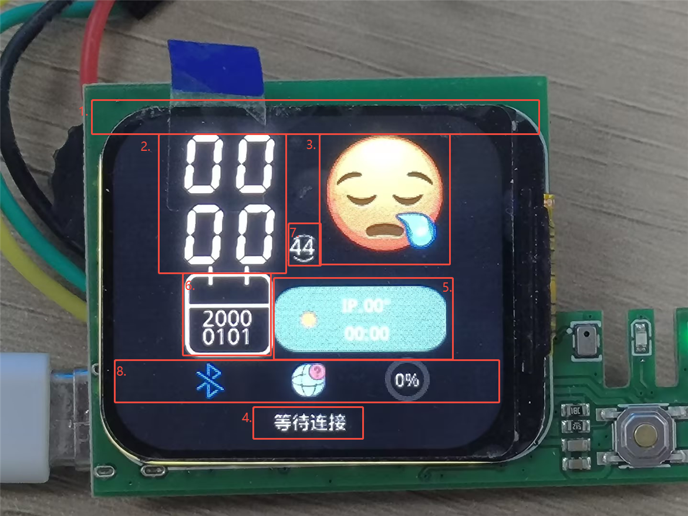

## 一、公版主页简介
这是小智的公版主页：

小智的主页主要可以分为以下几个部分：
1. 顶部栏：显示状态图标（蓝牙、网络、电池等）
2. 中央大时间显示：小时和分钟的数字显示
3. 右上角表情图标：根据小智状态变化
4. 底部状态栏：显示当前状态提示文字
5. 右侧天气信息区：显示天气图标、温度和IP地址
6. 左侧日历信息区：显示当前年份和日期
7. 秒数显示区：显示当前秒数
8. 底部状态提示：显示连接状态等信息
下面我们结合初始化代码，来分析一下公版主页的结构。

### 主页布局结构

小智的主页（standby_screen）采用分层设计，从上到下、从左到右包含以下元素：

#### 1. 屏幕容器和顶部栏
```c
// 获取屏幕分辨率
lv_coord_t scr_width = lv_disp_get_hor_res(NULL);
lv_coord_t scr_height = lv_disp_get_ver_res(NULL);
   
// 创建待机屏幕（黑色背景）
standby_screen = lv_obj_create(NULL);
lv_obj_clear_flag(standby_screen, LV_OBJ_FLAG_SCROLLABLE);
lv_obj_set_style_bg_color(standby_screen, lv_color_hex(0x000000), 0);

// 创建顶部栏（半透明背景，弹性布局）
lv_obj_t *standby_header_row = lv_obj_create(standby_screen);
lv_obj_remove_flag(standby_header_row, LV_OBJ_FLAG_SCROLLABLE);
lv_obj_set_size(standby_header_row, scr_width, SCALE_DPX(40));
lv_obj_set_style_bg_opa(standby_header_row, LV_OPA_0, 0);
lv_obj_set_style_border_width(standby_header_row, 0, 0);
lv_obj_set_flex_flow(standby_header_row, LV_FLEX_FLOW_ROW);
lv_obj_set_flex_align(standby_header_row, LV_FLEX_ALIGN_SPACE_BETWEEN,
                    LV_FLEX_ALIGN_CENTER, LV_FLEX_ALIGN_CENTER);
```

**设计要点**：
- 使用`lv_disp_get_hor_res()`和`lv_disp_get_ver_res()`获取屏幕实际分辨率
- 顶部栏使用弹性布局（FLEX），元素自动左右分布（SPACE_BETWEEN）
- 所有尺寸和坐标都乘以`g_scale`缩放因子，适配不同分辨率的屏幕

#### 2. 中央时间显示（大数字）
```c
// 小时十位数
hour_tens_img = lv_img_create(standby_screen);
LV_IMAGE_DECLARE(img_1);
lv_img_set_src(hour_tens_img, &img_1);
lv_obj_set_x(hour_tens_img, (int)(-142 * g_scale));
lv_obj_set_y(hour_tens_img, (int)(-163 * g_scale));
lv_obj_set_align(hour_tens_img, LV_ALIGN_CENTER);
lv_img_set_zoom(hour_tens_img, (int)(204 * g_scale));

// 小时个位数
hour_units_img = lv_img_create(standby_screen);
LV_IMAGE_DECLARE(img_2);
lv_img_set_src(hour_units_img, &img_2);
lv_obj_set_x(hour_units_img, (int)(-73 * g_scale));
lv_obj_set_y(hour_units_img, (int)(-163 * g_scale));
lv_img_set_zoom(hour_units_img, (int)(204 * g_scale));

// 分钟十位数
minute_tens_img = lv_img_create(standby_screen);
LV_IMAGE_DECLARE(img_3);
lv_img_set_src(minute_tens_img, &img_3);
lv_obj_set_x(minute_tens_img, (int)(-142 * g_scale));
lv_obj_set_y(minute_tens_img, (int)(-66 * g_scale));

// 分钟个位数
minute_units_img = lv_img_create(standby_screen);
LV_IMAGE_DECLARE(img_4);
lv_img_set_src(minute_units_img, &img_4);
lv_obj_set_x(minute_units_img, (int)(-73 * g_scale));
lv_obj_set_y(minute_units_img, (int)(-66 * g_scale));
```

**设计要点**：
- 时间采用图片数字显示，每个数字位独立控制
- 使用`LV_ALIGN_CENTER`作为基准点，通过偏移量调整位置
- `lv_img_set_zoom()`设置图片缩放比例（256 = 100%）

#### 3. 右上角表情图标
```c
img_emoji = lv_img_create(standby_screen);
LV_IMAGE_DECLARE(sleepy2);
LV_IMAGE_DECLARE(funny2);
lv_img_set_src(img_emoji, &sleepy2);  // 初始化提示小智还未连接
lv_obj_set_x(img_emoji, (int)(104 * g_scale));
lv_obj_set_y(img_emoji, (int)(-123 * g_scale));
lv_obj_set_align(img_emoji, LV_ALIGN_CENTER);
lv_img_set_zoom(img_emoji, (int)(LV_SCALE_NONE * g_scale));
```

表情图标会根据小智的状态动态切换（睡眠、开心、思考等）。

#### 4. 底部状态栏（左、中、右三个区域）

**左侧 - 蓝牙图标**：
```c
bluetooth_icon = lv_img_create(standby_screen);
LV_IMAGE_DECLARE(ble_icon_img);
lv_img_set_src(bluetooth_icon, &ble_icon_img);
lv_obj_set_x(bluetooth_icon, (int)(-134 * g_scale));
lv_obj_set_y(bluetooth_icon, (int)(133 * g_scale));
lv_obj_set_align(bluetooth_icon, LV_ALIGN_CENTER);
```

**中间 - 网络图标**：
```c
network_icon = lv_img_create(standby_screen);
LV_IMAGE_DECLARE(network_icon_img);
lv_img_set_src(network_icon, &network_icon_img);
lv_obj_set_x(network_icon, (int)(0 * g_scale));
lv_obj_set_y(network_icon, (int)(133 * g_scale));
lv_img_set_zoom(network_icon, (int)(384 * g_scale));
```

**右侧 - 电池环形进度条**：
```c
// 电池环形
battery_arc = lv_arc_create(standby_screen);
lv_obj_set_size(battery_arc, (int)(60 * g_scale), (int)(60 * g_scale));
lv_obj_set_x(battery_arc, (int)(134 * g_scale));
lv_obj_set_y(battery_arc, (int)(133 * g_scale));
lv_arc_set_rotation(battery_arc, 270); // 从顶部开始
lv_arc_set_bg_angles(battery_arc, 0, 360); // 背景圆环完整
lv_arc_set_value(battery_arc, g_battery_level); // 全局电量
lv_obj_remove_style(battery_arc, NULL, LV_PART_KNOB); // 移除旋钮
lv_obj_set_style_arc_color(battery_arc, lv_color_hex(0x333333), LV_PART_MAIN);
lv_obj_set_style_arc_color(battery_arc, lv_color_hex(0x00CC00), LV_PART_INDICATOR);
lv_obj_set_style_arc_width(battery_arc, (int)(8 * g_scale), LV_PART_MAIN);
lv_obj_set_style_arc_width(battery_arc, (int)(6 * g_scale), LV_PART_INDICATOR);

// 电池电量百分比文本
battery_percent_label = lv_label_create(battery_arc);
lv_label_set_text_fmt(battery_percent_label, "%d%%", g_battery_level);
lv_obj_set_style_text_color(battery_percent_label, lv_color_white(), 0);
lv_obj_set_style_text_font(battery_percent_label, font_medium, 0);
lv_obj_align(battery_percent_label, LV_ALIGN_CENTER, 0, 0);

// 充电图标（初始隐藏）
standby_charging_icon = lv_img_create(battery_arc);
lv_img_set_src(standby_charging_icon, &cdian2);
lv_obj_set_size(standby_charging_icon, 24, 24);
lv_obj_align(standby_charging_icon, LV_ALIGN_CENTER, 0, 0);
lv_obj_add_flag(standby_charging_icon, LV_OBJ_FLAG_HIDDEN);
```

**设计要点**：
- 使用`lv_arc`控件创建环形进度条
- `lv_arc_set_rotation(270)`让进度从12点方向开始
- 电量百分比标签作为arc的子对象，自动居中对齐

#### 5. 右侧天气信息区
```c
// 天气背景条
weather_bgimg = lv_img_create(standby_screen);
LV_IMAGE_DECLARE(strip);
lv_img_set_src(weather_bgimg, &strip);
lv_obj_set_x(weather_bgimg, (int)(70 * g_scale));
lv_obj_set_y(weather_bgimg, (int)(52 * g_scale));
lv_img_set_zoom(weather_bgimg, (int)(550 * g_scale));

// 天气图标
weather_icon = lv_img_create(standby_screen);
LV_IMAGE_DECLARE(sunny);
lv_img_set_src(weather_icon, &sunny);
lv_obj_set_x(weather_icon, (int)(0 * g_scale));
lv_obj_set_y(weather_icon, (int)(50 * g_scale));

// IP地址和温度
ui_Label_ip = lv_label_create(standby_screen);
lv_obj_set_x(ui_Label_ip, (int)(80 * g_scale));
lv_obj_set_y(ui_Label_ip, (int)(31 * g_scale));
lv_label_set_text(ui_Label_ip, "IP.00°");
lv_obj_add_style(ui_Label_ip, &style2, 0);

// 更新时间
last_time = lv_label_create(standby_screen);
lv_obj_set_x(last_time, (int)(80 * g_scale));
lv_obj_set_y(last_time, (int)(69 * g_scale));
lv_label_set_text(last_time, "00:00");
lv_obj_add_style(last_time, &style2, 0);
```

#### 6. 左侧日历信息区
```c
// 日历图标
ui_Image_calendar = lv_img_create(standby_screen);
LV_IMAGE_DECLARE(calendar);
lv_img_set_src(ui_Image_calendar, &calendar);
lv_obj_set_x(ui_Image_calendar, (int)(-107 * g_scale));
lv_obj_set_y(ui_Image_calendar, (int)(39 * g_scale));
lv_img_set_zoom(ui_Image_calendar, (int)(320 * g_scale));

// 年份标签
ui_Label_year = lv_label_create(standby_screen);
lv_obj_set_x(ui_Label_year, (int)(-109 * g_scale));
lv_obj_set_y(ui_Label_year, (int)(49 * g_scale));
lv_label_set_text(ui_Label_year, "2025");
lv_obj_add_style(ui_Label_year, &style, 0);

// 日期标签
ui_Label_day = lv_label_create(standby_screen);
lv_obj_set_x(ui_Label_day, (int)(-109 * g_scale));
lv_obj_set_y(ui_Label_day, (int)(74 * g_scale));
lv_label_set_text(ui_Label_day, "0801");
lv_obj_add_style(ui_Label_day, &style, 0);
```

#### 7. 秒数显示（中上部）
```c
// 秒数背景图
ui_Image_second = lv_img_create(standby_screen);
LV_IMAGE_DECLARE(second);
lv_img_set_src(ui_Image_second, &second);
lv_obj_set_x(ui_Image_second, (int)(-7 * g_scale));
lv_obj_set_y(ui_Image_second, (int)(-47 * g_scale));
lv_img_set_zoom(ui_Image_second, (int)(300 * g_scale));

// 秒数文本
ui_Label_second = lv_label_create(standby_screen);
lv_obj_set_x(ui_Label_second, (int)(-8 * g_scale));
lv_obj_set_y(ui_Label_second, (int)(-48 * g_scale));
lv_label_set_text(ui_Label_second, "00");
lv_obj_add_style(ui_Label_second, &style, 0);
```

#### 8. 底部状态提示
```c
ui_Label3 = lv_label_create(standby_screen);
lv_obj_set_x(ui_Label3, (int)(2 * g_scale));
lv_obj_set_y(ui_Label3, (int)(189 * g_scale));
lv_obj_set_align(ui_Label3, LV_ALIGN_CENTER);
lv_obj_add_style(ui_Label3, &style2, 0);
lv_label_set_text(ui_Label3, "等待连接");
```

### 关键技术点

1. **响应式设计**：所有尺寸都使用`g_scale`缩放因子，自适应不同屏幕
2. **图片数字**：时间显示用PNG图片而非字体，视觉效果更好
3. **分层管理**：所有UI元素都是`standby_screen`的子对象，便于统一管理
4. **样式复用**：通过`style`和`style2`统一文本样式
5. **动态更新**：保留控件指针（如`hour_tens_img`），方便后续更新内容


## 二、修改公版主页内容

了解了主页的结构后，我们可以通过修改代码来定制自己的主页效果。下面介绍几种常见的修改方法。

### 1. 修改背景颜色

在`xiaozhi_ui_obj_init()`函数中找到创建待机屏幕的代码：

```c
standby_screen = lv_obj_create(NULL);
lv_obj_clear_flag(standby_screen, LV_OBJ_FLAG_SCROLLABLE);
lv_obj_set_style_bg_color(standby_screen, lv_color_hex(0xefefef), 0);
```

**修改方法**：更改`lv_color_hex()`中的颜色值

```c
// 原来是浅灰色（0xefefef），改成其他颜色：
lv_obj_set_style_bg_color(standby_screen, lv_color_hex(0x000000), 0); // 黑色
lv_obj_set_style_bg_color(standby_screen, lv_color_hex(0x1A1A2E), 0); // 深蓝色
lv_obj_set_style_bg_color(standby_screen, lv_color_hex(0x2C3E50), 0); // 深灰蓝
```

**颜色格式说明**：`0xRRGGBB`，其中RR是红色、GG是绿色、BB是蓝色的十六进制值（00-FF）

### 2. 修改时间数字的位置和大小

时间数字由4个独立的图片组成，可以分别调整它们的位置和缩放：

```c
// 修改小时十位数的位置
lv_obj_set_x(hour_tens_img, (int)(-142 * g_scale));  // X坐标（负数向左，正数向右）
lv_obj_set_y(hour_tens_img, (int)(-163 * g_scale));  // Y坐标（负数向上，正数向下）

// 修改数字大小
lv_img_set_zoom(hour_tens_img, (int)(204 * g_scale)); // 原值204，改成256则是原始大小
```

**实例：让时间数字更大**
```c
// 将所有时间数字的缩放改成256（原始大小）
lv_img_set_zoom(hour_tens_img, (int)(256 * g_scale));
lv_img_set_zoom(hour_units_img, (int)(256 * g_scale));
lv_img_set_zoom(minute_tens_img, (int)(256 * g_scale));
lv_img_set_zoom(minute_units_img, (int)(256 * g_scale));
```

### 3. 修改电池环形进度条颜色

电池圆环的颜色可以根据电量动态改变：

```c
// 背景圆环颜色（灰色底色）
lv_obj_set_style_arc_color(battery_arc, lv_color_hex(0x333333), LV_PART_MAIN);

// 电量指示颜色（默认绿色）
lv_obj_set_style_arc_color(battery_arc, lv_color_hex(0x00CC00), LV_PART_INDICATOR);
```

**实例：根据电量变色**

在`xiaozhi_update_battery_level()`函数中添加颜色判断：

```c
void xiaozhi_update_battery_level(int level)
{
    g_battery_level = level;
    
    if (battery_arc != NULL) {
        lv_arc_set_value(battery_arc, level);
        
        // 根据电量设置不同颜色
        if (level <= 20) {
            // 低电量：红色
            lv_obj_set_style_arc_color(battery_arc, lv_color_hex(0xFF0000), LV_PART_INDICATOR);
        } else if (level <= 50) {
            // 中电量：黄色
            lv_obj_set_style_arc_color(battery_arc, lv_color_hex(0xFFCC00), LV_PART_INDICATOR);
        } else {
            // 高电量：绿色
            lv_obj_set_style_arc_color(battery_arc, lv_color_hex(0x00CC00), LV_PART_INDICATOR);
        }
    }
    
    // 更新电量百分比文本
    if (battery_percent_label != NULL) {
        lv_label_set_text_fmt(battery_percent_label, "%d%%", level);
    }
}
```

### 4. 修改图标的大小和位置

所有图标都可以通过调整位置和缩放来定制：

```c
// 表情图标
lv_obj_set_x(img_emoji, (int)(104 * g_scale));      // 调整X位置
lv_obj_set_y(img_emoji, (int)(-123 * g_scale));     // 调整Y位置
lv_img_set_zoom(img_emoji, (int)(128 * g_scale));   // 调整大小（128 = 50%原始大小）

// 蓝牙图标
lv_obj_set_x(bluetooth_icon, (int)(-134 * g_scale));
lv_obj_set_y(bluetooth_icon, (int)(133 * g_scale));
lv_img_set_zoom(bluetooth_icon, (int)(LV_SCALE_NONE * g_scale)); // LV_SCALE_NONE = 256 = 100%

// 网络图标（放大1.5倍）
lv_img_set_zoom(network_icon, (int)(384 * g_scale));  // 384 = 150%
```

**提示**：`lv_img_set_zoom()`的参数说明
- 256 = 100%（原始大小）
- 128 = 50%
- 512 = 200%
- 384 = 150%

### 5. 修改文本内容和样式

底部状态提示文字可以自定义：

```c
ui_Label3 = lv_label_create(standby_screen);
lv_obj_set_x(ui_Label3, (int)(2 * g_scale));
lv_obj_set_y(ui_Label3, (int)(189 * g_scale));
lv_obj_set_align(ui_Label3, LV_ALIGN_CENTER);
lv_obj_add_style(ui_Label3, &style2, 0);
lv_label_set_text(ui_Label3, "等待连接");  // 修改这里的文字
```

**实例：改成其他提示语**
```c
lv_label_set_text(ui_Label3, "小智待命中");
lv_label_set_text(ui_Label3, "Ready");
lv_label_set_text(ui_Label3, "设备就绪");
```

### 6. 修改字体大小

在`xiaozhi_ui_task()`函数中可以看到字体的创建：

```c
float scale = get_scale_factor();
const int medium_font_size = (int)(25 * scale + 0.5f);    // 秒显示
font_medium = lv_tiny_ttf_create_data(xiaozhi_font, xiaozhi_font_size, medium_font_size);
```

**修改方法**：改变字体大小参数
```c
const int medium_font_size = (int)(30 * scale + 0.5f);  // 从25改成30，字体更大
const int medium_font_size = (int)(20 * scale + 0.5f);  // 从25改成20，字体更小
```

### 7. 隐藏或显示某个元素

如果不想显示某个元素，可以使用隐藏标志：

```c
// 隐藏元素
lv_obj_add_flag(img_emoji, LV_OBJ_FLAG_HIDDEN);        // 隐藏表情图标
lv_obj_add_flag(ui_Label3, LV_OBJ_FLAG_HIDDEN);        // 隐藏底部提示文字
lv_obj_add_flag(weather_icon, LV_OBJ_FLAG_HIDDEN);     // 隐藏天气图标

// 显示元素（如果之前被隐藏）
lv_obj_clear_flag(img_emoji, LV_OBJ_FLAG_HIDDEN);
```

**实例：初始隐藏充电图标**
```c
standby_charging_icon = lv_img_create(battery_arc);
lv_img_set_src(standby_charging_icon, &cdian2);
lv_obj_set_size(standby_charging_icon, 24, 24);
lv_obj_align(standby_charging_icon, LV_ALIGN_CENTER, 0, 0);
lv_obj_add_flag(standby_charging_icon, LV_OBJ_FLAG_HIDDEN); // 初始隐藏
```

### 8. 修改电池圆环的大小和宽度

```c
// 修改电池圆环尺寸
lv_obj_set_size(battery_arc, (int)(60 * g_scale), (int)(60 * g_scale)); // 改成80看起来更大

// 修改圆环线条粗细
lv_obj_set_style_arc_width(battery_arc, (int)(8 * g_scale), LV_PART_MAIN);      // 背景线宽度
lv_obj_set_style_arc_width(battery_arc, (int)(6 * g_scale), LV_PART_INDICATOR); // 指示线宽度
```

**实例：更粗的电池圆环**
```c
lv_obj_set_style_arc_width(battery_arc, (int)(12 * g_scale), LV_PART_MAIN);      // 从8改成12
lv_obj_set_style_arc_width(battery_arc, (int)(10 * g_scale), LV_PART_INDICATOR); // 从6改成10
```

### 9. 调整秒数显示的位置

秒数显示包含背景图和文本，可以整体移动：

```c
// 秒数背景图位置
lv_obj_set_x(ui_Image_second, (int)(-7 * g_scale));
lv_obj_set_y(ui_Image_second, (int)(-98 * g_scale));  // Y坐标，改这个值可以上下移动

// 秒数文本位置（保持和背景图一致）
lv_obj_set_x(ui_Label_second, (int)(-8 * g_scale));
lv_obj_set_y(ui_Label_second, (int)(-98 * g_scale));  // 和背景图对齐
```

### 10. 修改日历和天气区域的缩放

```c
// 日历图标缩放
lv_img_set_zoom(ui_Image_calendar, (int)(320 * g_scale));  // 改成256是原始大小，400是更大

// 天气背景条缩放
lv_img_set_zoom(weather_bgimg, (int)(550 * g_scale));      // 调整天气区域背景大小

// 天气图标缩放
lv_img_set_zoom(weather_icon, (int)(LV_SCALE_NONE * g_scale));  // LV_SCALE_NONE = 256
```

### 修改技巧总结

1. **位置调整**：修改`lv_obj_set_x()`和`lv_obj_set_y()`的参数
   - 负数向左/上移动
   - 正数向右/下移动
   - 记得乘以`g_scale`保持响应式

2. **大小调整**：修改`lv_img_set_zoom()`的参数
   - 256 = 100%原始大小
   - 数值越大图片越大

3. **颜色修改**：使用`lv_color_hex(0xRRGGBB)`
   - RR = 红色（00-FF）
   - GG = 绿色（00-FF）
   - BB = 蓝色（00-FF）

4. **文本修改**：使用`lv_label_set_text()`直接修改显示文字

5. **隐藏/显示**：使用`lv_obj_add_flag()`和`lv_obj_clear_flag()`配合`LV_OBJ_FLAG_HIDDEN`

**重要提示**：修改后需要重新编译工程才能看到效果！
### 示例：自定义主页效果


## 三、添加温湿度传感器显示

在这一部分，我们将学习如何在主页上添加温湿度传感器数据显示。这涉及到硬件连接、驱动添加、UI元素创建和数据读取等多个环节。

### 1. 硬件连接

SHT30是一款常用的I2C接口温湿度传感器。需要连接4根线：

```
SHT30传感器  →  开发板
VCC         →  3.3V
GND         →  GND
SDA         →  PA11 (I2C2_SDA)
SCL         →  PA10 (I2C2_SCL)
```

**注意**：确保传感器的VCC接到3.3V，不要接到5V，否则可能损坏传感器。

### 2. 添加传感器驱动

如果工程中还没有SHT30驱动，需要添加驱动文件：
- `sht30.h` - 驱动头文件
- `sht30.c` - 驱动实现文件

驱动文件通常放在`app/src`目录或专门的驱动目录中。

**sht30.h 基本接口**：
```c
// 初始化SHT30传感器
void sht30_init(void);

// 读取温湿度数据
// temp: 温度指针，单位℃
// humi: 湿度指针，单位%RH
void sht30_measure(float *temp, float *humi);
```

### 3. 在UI中添加温湿度显示元素

#### 步骤1：在 xiaozhi_ui.c 中声明全局变量

在文件开头的全局变量区域添加：

```c
// 温湿度标签（在其他全局变量声明附近）
lv_obj_t *ui_Label_temperature = NULL;  // 温度标签
lv_obj_t *ui_Label_humidity = NULL;     // 湿度标签

// 声明外部变量（数据由main.c提供）
extern float g_current_temperature;
extern float g_current_humidity;
```

#### 步骤2：创建温湿度更新回调函数

添加一个函数用于更新UI显示：

```c
void temp_humi_update_cb()
{
    // 更新UI标签
    if (ui_Label_temperature != NULL && ui_Label_humidity != NULL)
    {
        // 格式化温度字符串，保留1位小数
        lv_label_set_text_fmt(ui_Label_temperature, "温度: %.1f°C", g_current_temperature);
        
        // 格式化湿度字符串，保留1位小数
        lv_label_set_text_fmt(ui_Label_humidity, "湿度: %.1f%%", g_current_humidity);
    }
}
```

#### 步骤3：在初始化函数中创建UI元素

在`xiaozhi_ui_obj_init()`函数的待机界面创建部分，添加温湿度标签：

```c
// 在创建其他UI元素后添加（建议放在底部状态提示附近）

// 温度标签
ui_Label_temperature = lv_label_create(standby_screen);
lv_obj_set_width(ui_Label_temperature, LV_SIZE_CONTENT);
lv_obj_set_height(ui_Label_temperature, LV_SIZE_CONTENT);
lv_obj_set_x(ui_Label_temperature, (int)(-100 * g_scale));  // X位置，可根据需要调整
lv_obj_set_y(ui_Label_temperature, (int)(150 * g_scale));   // Y位置，屏幕下方
lv_obj_set_align(ui_Label_temperature, LV_ALIGN_CENTER);
lv_label_set_text(ui_Label_temperature, "温度: --.-°C");    // 初始显示
lv_obj_add_style(ui_Label_temperature, &style2, 0);         // 使用预定义样式

// 湿度标签
ui_Label_humidity = lv_label_create(standby_screen);
lv_obj_set_width(ui_Label_humidity, LV_SIZE_CONTENT);
lv_obj_set_height(ui_Label_humidity, LV_SIZE_CONTENT);
lv_obj_set_x(ui_Label_humidity, (int)(100 * g_scale));      // X位置，温度标签右侧
lv_obj_set_y(ui_Label_humidity, (int)(150 * g_scale));      // Y位置，与温度对齐
lv_obj_set_align(ui_Label_humidity, LV_ALIGN_CENTER);
lv_label_set_text(ui_Label_humidity, "湿度: --.-%");        // 初始显示
lv_obj_add_style(ui_Label_humidity, &style2, 0);            // 使用预定义样式
```

**位置调整说明**：
- X坐标：`-100`和`100`让两个标签左右分布
- Y坐标：`150`放在屏幕下方，不遮挡其他元素
- 可以根据实际屏幕布局调整这些数值

### 4. 在主程序中添加数据读取

#### 步骤1：在 main.c 中定义全局变量

在文件开头添加：

```c
#include "sht30.h"  // 包含SHT30驱动头文件

// 定义全局变量存储温湿度数据
float g_current_temperature = 25.0f;  // 默认温度25℃
float g_current_humidity = 50.0f;     // 默认湿度50%RH

// 温湿度线程控制块
rt_thread_t temp_humi_thread = RT_NULL;
```

#### 步骤2：创建温湿度读取线程

添加线程函数，周期性读取传感器数据：

```c
void temp_humi_update_thread(void *parameter)
{
    while (1)
    {
        float temp = 0;
        float humi = 0;
        
        // 读取SHT30传感器数据
        sht30_measure(&temp, &humi);
        
        // 更新全局变量
        g_current_temperature = temp;
        g_current_humidity = humi;
        
        // 调用UI更新回调（如果需要）
        // temp_humi_update_cb();  // 可选：在这里直接更新UI
        
        // 每1秒读取一次
        rt_thread_mdelay(1000);
    }
}
```

#### 步骤3：在 main() 函数中初始化I2C和创建线程

在`main()`函数中，在创建其他线程之后添加：

```c
int main(void)
{
    // ... 其他初始化代码 ...
    
    // 配置I2C引脚（用于SHT30通信）
    HAL_PIN_Set(PAD_PA11, I2C2_SDA, PIN_PULLUP, 1);  // I2C数据线，上拉
    HAL_PIN_Set(PAD_PA10, I2C2_SCL, PIN_PULLUP, 1);  // I2C时钟线，上拉
    
    // 创建温湿度读取线程
    temp_humi_thread = rt_thread_create(
        "temp_humi",                    // 线程名称
        temp_humi_update_thread,        // 线程入口函数
        RT_NULL,                        // 参数（这里不需要）
        1024,                           // 线程栈大小
        25,                             // 优先级（数字越小优先级越高）
        10                              // 时间片
    );
    
    if (temp_humi_thread != RT_NULL)
    {
        rt_thread_startup(temp_humi_thread);  // 启动线程
        rt_kprintf("Temperature and humidity thread created successfully\n");
    }
    else
    {
        rt_kprintf("Failed to create temp_humi_thread\n");
    }
    
    // ... 其他代码 ...
}
```

### 5. 定时更新UI显示

有两种方式更新UI中的温湿度显示：

#### 方式1：在UI主循环中定时调用

在`xiaozhi_ui_task()`的主循环中，定期调用更新函数：

```c
void xiaozhi_ui_task(void *args)
{
    // ... 初始化代码 ...
    
    while(1) {
        // ... 处理其他消息 ...
        
        // 每次循环更新温湿度显示
        temp_humi_update_cb();
        
        // ... 其他代码 ...
    }
}
```

#### 方式2：使用LVGL定时器

创建一个LVGL定时器，定期更新显示：

```c
// 在xiaozhi_ui_obj_init()中添加
static void temp_humi_timer_cb(lv_timer_t *timer)
{
    temp_humi_update_cb();
}

// 创建定时器，每2秒更新一次
lv_timer_t *temp_humi_timer = lv_timer_create(temp_humi_timer_cb, 2000, NULL);
```

### 6. 完整的代码文件修改清单

**xiaozhi_ui.c 需要修改的地方**：

1. 添加头文件（如果需要）
2. 添加全局变量声明（第230行附近）
3. 添加`temp_humi_update_cb()`函数（第234-240行）
4. 在`xiaozhi_ui_obj_init()`中创建UI元素（第987-1032行）

**main.c 需要修改的地方**：

1. 添加`#include "sht30.h"`头文件
2. 添加全局变量定义（第78-80行）
3. 添加`temp_humi_update_thread()`函数（第81-93行）
4. 在`main()`中配置I2C引脚（第792-793行）
5. 在`main()`中创建线程（第794-805行）

### 7. 调整UI布局建议

根据屏幕大小和现有元素分布，可以选择不同的布局方案：

**方案1：放在屏幕底部中央**
```c
lv_obj_set_x(ui_Label_temperature, (int)(-80 * g_scale));
lv_obj_set_y(ui_Label_temperature, (int)(170 * g_scale));
lv_obj_set_x(ui_Label_humidity, (int)(80 * g_scale));
lv_obj_set_y(ui_Label_humidity, (int)(170 * g_scale));
```

**方案2：放在天气信息下方**
```c
lv_obj_set_x(ui_Label_temperature, (int)(70 * g_scale));
lv_obj_set_y(ui_Label_temperature, (int)(100 * g_scale));
lv_obj_set_x(ui_Label_humidity, (int)(70 * g_scale));
lv_obj_set_y(ui_Label_humidity, (int)(120 * g_scale));
```

**方案3：放在日历左侧**
```c
lv_obj_set_x(ui_Label_temperature, (int)(-120 * g_scale));
lv_obj_set_y(ui_Label_temperature, (int)(100 * g_scale));
lv_obj_set_x(ui_Label_humidity, (int)(-120 * g_scale));
lv_obj_set_y(ui_Label_humidity, (int)(120 * g_scale));
```

### 8. 调试技巧

#### 检查传感器是否正常工作

在`temp_humi_update_thread()`中添加调试输出：

```c
void temp_humi_update_thread(void *parameter)
{
    while (1)
    {
        float temp = 0;
        float humi = 0;
        sht30_measure(&temp, &humi);
        
        // 打印调试信息
        rt_kprintf("Temperature: %.1f°C, Humidity: %.1f%%\n", temp, humi);
        
        g_current_temperature = temp;
        g_current_humidity = humi;
        
        rt_thread_mdelay(1000);
    }
}
```

#### 检查UI是否正常更新

在`temp_humi_update_cb()`中添加调试输出：

```c
void temp_humi_update_cb()
{
    if (ui_Label_temperature != NULL && ui_Label_humidity != NULL)
    {
        rt_kprintf("Updating UI: T=%.1f, H=%.1f\n", 
                   g_current_temperature, g_current_humidity);
        
        lv_label_set_text_fmt(ui_Label_temperature, "温度: %.1f°C", g_current_temperature);
        lv_label_set_text_fmt(ui_Label_humidity, "湿度: %.1f%%", g_current_humidity);
    }
    else
    {
        rt_kprintf("UI labels are NULL!\n");
    }
}
```

### 9. 常见问题解决

**问题1：传感器读取失败**
- 检查硬件连接是否正确
- 检查I2C引脚配置是否正确
- 使用I2C扫描工具检查传感器地址（SHT30默认地址是0x44）

**问题2：UI不显示或显示位置不对**
- 检查坐标值是否合适
- 确认`g_scale`缩放因子已正确计算
- 尝试修改X、Y坐标值进行调整

**问题3：数据不更新**
- 检查线程是否成功创建并运行
- 确认`temp_humi_update_cb()`被定期调用
- 查看串口输出的调试信息

**问题4：显示格式不正确**
- 检查`lv_label_set_text_fmt()`的格式字符串
- 确认使用`%.1f`显示一位小数

### 10. 扩展功能

在掌握基本的温湿度显示后，可以考虑添加以下功能：

1. **异常提醒**：当温湿度超出正常范围时改变颜色或显示警告
2. **历史记录**：记录温湿度变化曲线
3. **图表显示**：使用LVGL的图表控件显示趋势
4. **多传感器**：添加更多类型的传感器（气压、光照等）

### 完整代码示例

**xiaozhi_ui.c 关键代码片段**：
```c
// 全局变量（文件开头）
lv_obj_t *ui_Label_temperature = NULL;
lv_obj_t *ui_Label_humidity = NULL;
extern float g_current_temperature;
extern float g_current_humidity;

// 更新回调函数
void temp_humi_update_cb()
{
    if (ui_Label_temperature != NULL && ui_Label_humidity != NULL)
    {
        lv_label_set_text_fmt(ui_Label_temperature, "温度: %.1f°C", g_current_temperature);
        lv_label_set_text_fmt(ui_Label_humidity, "湿度: %.1f%%", g_current_humidity);
    }
}

// 在xiaozhi_ui_obj_init()中创建UI元素
ui_Label_temperature = lv_label_create(standby_screen);
lv_obj_set_width(ui_Label_temperature, LV_SIZE_CONTENT);
lv_obj_set_height(ui_Label_temperature, LV_SIZE_CONTENT);
lv_obj_set_x(ui_Label_temperature, (int)(-100 * g_scale));
lv_obj_set_y(ui_Label_temperature, (int)(150 * g_scale));
lv_obj_set_align(ui_Label_temperature, LV_ALIGN_CENTER);
lv_label_set_text(ui_Label_temperature, "温度: --.-°C");
lv_obj_add_style(ui_Label_temperature, &style2, 0);

ui_Label_humidity = lv_label_create(standby_screen);
lv_obj_set_width(ui_Label_humidity, LV_SIZE_CONTENT);
lv_obj_set_height(ui_Label_humidity, LV_SIZE_CONTENT);
lv_obj_set_x(ui_Label_humidity, (int)(100 * g_scale));
lv_obj_set_y(ui_Label_humidity, (int)(150 * g_scale));
lv_obj_set_align(ui_Label_humidity, LV_ALIGN_CENTER);
lv_label_set_text(ui_Label_humidity, "湿度: --.-%");
lv_obj_add_style(ui_Label_humidity, &style2, 0);
```

**main.c 关键代码片段**：
```c
#include "sht30.h"

float g_current_temperature = 25.0f;
float g_current_humidity = 50.0f;
rt_thread_t temp_humi_thread = RT_NULL;

void temp_humi_update_thread(void *parameter)
{
    while (1)
    {
        float temp = 0;
        float humi = 0;
        sht30_measure(&temp, &humi);
        g_current_temperature = temp;
        g_current_humidity = humi;
        rt_thread_mdelay(1000);
    }
}

int main(void)
{
    // ... 其他代码 ...
    
    HAL_PIN_Set(PAD_PA11, I2C2_SDA, PIN_PULLUP, 1); 
    HAL_PIN_Set(PAD_PA10, I2C2_SCL, PIN_PULLUP, 1);
    
    temp_humi_thread = rt_thread_create("temp_humi", 
                                        temp_humi_update_thread, 
                                        RT_NULL, 1024, 25, 10);
    if (temp_humi_thread != RT_NULL)
    {
        rt_thread_startup(temp_humi_thread);
    }
    
    // ... 其他代码 ...
}
```

通过以上步骤，你就可以在小智的主页上成功添加温湿度传感器的实时显示了！
### 结果展示
