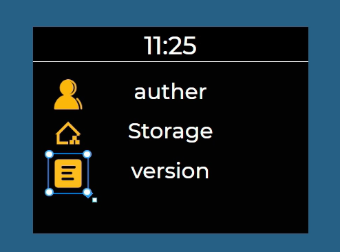
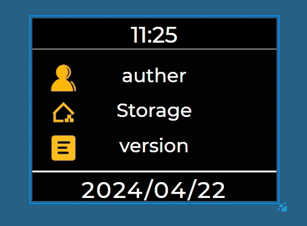

本文档详细介绍小智工程中屏保界面的**UI搭建、屏幕切换逻辑开发、网络数据获取与时间同步**全流程，最终实现一个具备动态仓库信息展示、时间日期同步、硬件触发切换的完整屏保功能。

## 一、新建屏保屏幕与基础UI搭建

完成屏保界面的可视化静态搭建，搭建“顶部时钟-中间仓库信息-底部日期”的三层布局，为后续动态功能落地提供统一、整洁的UI载体，适配320*240分辨率设备，保证黑白对比风格的视觉一致性。

### 1.1 新建屏保工程与空白屏幕

搭建屏保工程的基础框架，创建空白屏幕并配置核心底色，为后续UI组件添加铺路。

1. 打开小智工程工具，选择`lvgl 9.2.1`版本作为UI框架基础；
2. 新建工程，模板选择「空的UI」，工程名称命名为`xty_mianclass`，面板分辨率配置为`320*240`（适配目标设备）；
3. 新建空白屏幕，将屏幕**背景颜色统一设置为纯黑色**，作为屏保的基础底色，确保后续组件显示对比度充足。

### 1.2 UI组件分步配置与布局

按“顶部→中间→底部”的视觉布局顺序，依次添加并精细化配置时钟、sf-pkg仓库信息、日期三类UI组件，保持风格统一、布局规整。
实现屏保核心信息的静态可视化展示，明确各区域功能划分，为后续绑定动态数据（网络、时间）做好准备。

#### 1.2.1 顶部时钟容器与数字时钟配置

添加顶部容器与数字时钟组件，配置尺寸、显示内容和样式，实现简洁的时分显示。

1. 添加容器组件
    - 坐标设置：`x=0`、`y=0`，宽度`320`，高度`41`（与屏幕宽度一致，适配顶部布局）；
    - 样式设置：背景颜色为**纯黑色**（与屏幕底色统一），仅开启**下边框**，边框颜色为白色。
2. 添加数字时钟组件
    - 归属设置：将数字时钟添加至上述顶部容器中，作为子组件；
    - 坐标与尺寸：`x=0`、`y=0`，宽度`320`，高度`40`（填满容器，预留1px边框空间）；
    - 显示设置：取消「秒钟」和「AM/PM（上下午）」的显示（仅保留时、分，简化屏保信息）；
    - 样式设置：背景颜色为**纯黑色**（与容器、屏幕底色统一），字体大小`30`，字体类型选择`montserratMedium`，字体颜色为白色。


#### 1.2.2 sf-pkg仓库信息展示

按统一规范添加三组“图片+标签”组件，配置资源、内容和布局，可视化承载sf-pkg仓库的核心信息。
该步骤用于展示sf-pkg仓库的核心信息（auther、Storage、version），三组组件保持布局一致，提升整洁度。

##### 通用配置要求

- 图片通用配置：宽度`40`、高度`40`；
- 标签通用配置：宽度`190`、高度`30`，字体颜色白色，字体大小`25`，字体类型建议与时钟保持一致（`montserratMedium`，保证整体UI风格统一）；
- 命名规范：图片与对应标签需按内容关联命名，`img_auther`对应`label_auther`、`img_storage`对应`label_storage`、`img_version`对应`label_version`。

##### 分步操作

1. 图片资源准备：根据标签内容，导入对应功能的图标图片，在小智工程中完成图片格式转换，并绑定至对应的图片组件；
2. 组件添加与内容设置：
    - 第一组：图片绑定auther对应图标，标签名称添加后缀`"auther"`；
    - 第二组：图片绑定Storage对应图标，标签名称添加后缀`"Storage"`；
    - 第三组：图片绑定version对应图标，标签名称添加后缀`"version"`；
3. 布局对齐：将三组「图片+标签」进行统一布局，通过gui-guider的「对齐工具」完成布局调整。


#### 1.2.3 底部日期组件配置

添加底部日期组件，配置尺寸、样式和边框，补充屏保的日期信息展示，与顶部时钟形成视觉呼应

1. 从组件菜单中选择「日期组件」，添加至屏幕底部；
2. 尺寸与坐标设置：宽度`320`（与屏幕宽度一致），高度`40`，设置x坐标为0，y坐标为199；
3. 样式与显示设置：
    - 背景颜色为**纯黑色**（与整体风格统一）；
    - 字体设置：字体大小`30`，字体颜色白色，字体类型`montserratMedium`；
    - 边框设置：仅开启**上边框**，边框颜色为白色。


## 二、屏幕切换

基于旋转编码器实现「新屏保界面」与「原有界面」的双向稳定切换，保证切换逻辑不干扰原有系统功能，无重复触发、无功能异常，实现硬件操作与界面切换的联动。

### 2.1 代码修改

导入新界面后，修改UI初始化相关代码，确保新屏保界面正常初始化，同时保留原有界面功能，预留手动切换触发条件。
这里需要按照前面移植gui-guider工程的方法对工程进行移植
新界面导入完成后，需先对UI初始化相关代码进行修改，确保新屏保界面正常加载且不影响原有界面功能：

1. 打开`xiaozhi_ui.c`文件，搜索函数`xiaozhi_ui_task`，下滑找到内部调用的`xiaozhi_ui_obj_init()`函数；
2. 注意事项：**不要在低电量相关代码块中添加内容，且无需修改或隐藏原有界面的初始化代码**；
3. 在`xiaozhi_ui_obj_init()`函数调用的下一行，添加新界面初始化代码：`setup_ui(&guider_ui);`；
4. 跳转至`setup_ui()`函数内部，注释掉其中的屏幕加载函数（避免新界面自动加载，预留手动切换触发条件）。

### 2.2 定义旋转编码器屏幕切换标志位

定义全局切换标志位并完成外部声明，建立旋转编码器与界面切换逻辑之间的信息传递通道。

为传递旋转编码器的旋转方向信息，需添加全局标志位并完成外部声明：

1. 打开`encoder_siq.c`文件，在文件顶部添加切换标志位定义：

    ```c
    // 屏幕切换标志位：1=左旋转（切新屏保）、-1=右旋转（切原界面）、0=无旋转
    int screen_switch_flag = 0;
    ```

2. 在对应的头文件（如`encoder_siq.h`）中完成外部声明，确保其他文件可访问该标志位：

    ```c
    #ifndef __ENCODER_SIQ_H
    #define __ENCODER_SIQ_H

    // 外部声明屏幕切换标志位
    extern int screen_switch_flag;

    // 其他原有声明内容...
    #endif
    ```

### 2.3 完善旋转编码器方向判断逻辑

修改`Get_count`回调函数，添加计数值对比逻辑，精准识别编码器旋转方向并更新切换标志位。

1. 打开`encoder_siq.c`中的`Get_count`函数，完善内部逻辑，完整代码如下：

    ```c
    void Get_count(void*argv)
    {
        // 静态变量：记录上一次的编码器计数值，仅初始化一次
        static int last_count1 = 0;
        rt_err_t result1;
        struct rt_encoder_configuration config_count1;
        config_count1.get_count = 0;

        // 获取当前编码器计数值
        result1 = rt_device_control((struct rt_device *)encoder_device1, PULSE_ENCODER_CMD_GET_COUNT, (void *)&config_count1);
        
        if (result1 != RT_EOK)
        {
            rt_kprintf("Failed to get encoder count\n");
        }
        else
        {
            // 删除原有打印计数值的代码，添加方向判断逻辑
            if(config_count1.get_count > last_count1)
            {
                // 本次计数值>上次：编码器左旋转
                screen_switch_flag = 1; // 标记左旋转，用于切换新屏保
                rt_kprintf("left turn\n");
            }
            else if(config_count1.get_count < last_count1)
            {
                // 本次计数值<上次：编码器右旋转
                screen_switch_flag = -1; // 标记右旋转，用于切换原界面
                rt_kprintf("right turn\n");
            }
            else
            {
                // 本次计数值=上次：编码器无旋转
                screen_switch_flag = 0; // 标记无操作
            }

            // 更新静态变量，保存本次计数值作为下次对比的基准
            last_count1 = config_count1.get_count;
        }
    }
    ```

2. 关键说明：通过静态变量`last_count1`记录历史计数值，通过当前值与历史值的对比，精准判断旋转方向，并更新`screen_switch_flag`标志位。

### 2.4 扩展UI消息体系

基于原有UI消息框架，扩展新屏保的切换消息通道，包含新增消息类型、编写发送函数、完善处理逻辑，实现规范化的界面切换触发与响应。

#### 2.4.1 新增屏幕切换消息类型

在UI消息枚举中添加新屏保切换的专属消息类型，为消息传递定义唯一标识。

在UI消息类型枚举中，添加`UI_MSG_SWITCH_TO_NEW`（新屏保切换消息）：

```c
// 原有UI消息类型枚举
typedef enum {
    UI_MSG_XXX, // 原有消息
    UI_MSG_SWITCH_TO_NEW, // 新增：切换至新屏保界面
    // 其他原有消息...
} UI_MSG_TYPE;
```

#### 2.4.2 编写新屏保消息发送函数

复制原有界面切换的消息发送函数，修改函数名与消息类型，形成新屏保切换的专属发送函数。

1. 搜索`xiaozhi_ui.c`中的`ui_switch_to`相关函数（原有界面切换消息发送函数）；
2. 复制该函数，粘贴在其下方，修改函数名与消息类型，形成新屏保切换的消息发送函数：

    ```c
    // 新增：切换至新屏保界面的消息发送函数
    void ui_switch_to_xiaozhi_NEW_screen(void)
    {
        // 发送新屏保切换消息，沿用原有消息发送逻辑
        ui_msg_send(UI_MSG_SWITCH_TO_NEW, NULL, 0);
    }
    ```

#### 2.4.3 完善新屏保消息处理逻辑

复制原有界面切换的消息处理逻辑，修改消息类型与加载界面，实现新屏保界面的加载与状态重置。

1. 搜索`xiaozhi_ui.c`中原有消息类型的处理函数（如`UI_MSG_SWITCH_TO_STANDBY`）；
2. 复制该消息对应的`case`处理代码，粘贴在其上方，修改消息类型为`UI_MSG_SWITCH_TO_NEW`，并替换为新屏保界面的加载逻辑：

    ```c
    // UI消息处理函数内部（原有switch-case结构中）
    switch (msg->type)
    {
        case UI_MSG_SWITCH_TO_NEW:
            // 销毁原有睡眠定时器（若存在）
            if(guider_ui.screen)
            {
                if(ui_sleep_timer)
                {
                    lv_timer_delete(ui_sleep_timer);
                    ui_sleep_timer = NULL;
                }
            }
            // 加载新屏保界面
            lv_screen_load(guider_ui.screen);
            // 调整容器层级，确保显示正常
            lv_obj_set_parent(cont, lv_screen_active());
            lv_obj_move_foreground(cont);
            break;

        case UI_MSG_SWITCH_TO_STANDBY: // 原有消息
            // 原有处理逻辑...
            break;

        // 其他原有消息处理...
    }
    ```

### 2.5 UI任务中添加屏幕切换触发逻辑

在UI任务主循环中添加标志位判断，根据编码器状态调用对应切换函数，实现双向界面切换并防止重复触发。

在`xiaozhi_ui_task`的主循环中，添加`screen_switch_flag`的判断，实现标志位驱动的界面切换：

1. 打开`xiaozhi_ui.c`，找到`xiaozhi_ui_task`函数中的`while`循环；
2. 在循环内部添加标志位处理逻辑，完整代码片段如下：

    ```c
    void xiaozhi_ui_task(void* parameter)
    {
        // 原有初始化代码...

        while(1)
        {
            // 其他原有任务逻辑...

            // 新增：处理屏幕切换事件
            if (screen_switch_flag == 1)
            {
                // 左旋转：切换至新屏保界面
                ui_switch_to_xiaozhi_NEW_screen();
                screen_switch_flag = 0; // 重置标志位，避免重复触发
            }
            else if (screen_switch_flag == -1)
            {
                // 右旋转：切换回原有界面
                ui_switch_to_standby_screen(); // 调用原有界面切换函数
                screen_switch_flag = 0; // 重置标志位，避免重复触发
            }

            // 原有延时或其他逻辑...
        }
    }
    ```

3. 关键说明：每次切换完成后需立即重置`screen_switch_flag`为0，防止循环中重复触发同一切换操作。

## 三、网络操作

实现sf-pkg仓库信息的**HTTPS获取、JSON解析与UI标签绑定**，同步系统时间到屏保的时钟与日期组件，完成屏保的动态数据填充，实现从静态UI到全功能屏保的落地。

### 3.1 核心HTTP请求函数

编写完整的HTTP请求函数，涵盖网络检查、URL配置、会话创建、数据接收、JSON解析、UI更新与资源释放全流程，实现sf-pkg仓库信息的动态获取与展示。

该函数实现网络检查、HTTPS GET请求、JSON数据解析与UI标签更新，完整步骤与代码如下：

```c
void http_request(void)
{
    // 1. 定义核心变量
    char *pkg_url = RT_NULL;                // 存储请求目标地址
    struct webclient_session *session = RT_NULL; // HTTP会话对象（管理请求生命周期）
    int resp_status;                        // HTTP响应状态码
    char *buffer = RT_NULL;                 // 存储服务器返回数据的缓冲区
    int content_length = 0;                 // 服务器返回数据总大小
    int bytes_read = 0;                     // 实际读取到的数据量

    cJSON *root = RT_NULL;                  // JSON根对象（入口点）
    cJSON *data_obj = RT_NULL;              // 指向JSON中的data字段
    cJSON *name_obj = RT_NULL;              // 存储仓库名称（对应Storage）
    cJSON *namespace_obj = RT_NULL;         // 存储作者名称（对应auther）
    cJSON *version_obj = RT_NULL;           // 存储版本信息（对应version）

    // 2. 网络连接检查
    if (check_internet_access() == 0)
    {
        rt_kprintf("no internet access\n");
        return; // 网络异常，直接返回
    }

    // 3. 为URL分配内存并配置目标地址
    pkg_url = rt_calloc(1, GET_URL_LEN_MAX);
    if (pkg_url == RT_NULL)
    {
        rt_kprintf("malloc fail for pkg_url\n");
        goto __exit; // 内存分配失败，跳转至资源释放
    }
    // 拼接sf-pkg仓库接口地址
    rt_snprintf(pkg_url, GET_URL_LEN_MAX, "https://packages.sifli.com/api/v1/packages/sht30");

    // 4. 创建HTTPS会话并发起GET请求
    session = webclient_session_create(GET_HEADER_BUFSZ);
    if (session == RT_NULL)
    {
        rt_kprintf("no memory for get header\n");
        goto __exit; // 会话创建失败，跳转至资源释放
    }
    rt_kprintf("http_request url:%s\n", pkg_url); // 打印请求URL

    // 发送GET请求，判断响应状态（200为请求成功）
    resp_status = webclient_get(session, pkg_url);
    if (resp_status != 200)
    {
        rt_kprintf("webclient get request failed, response(%d) error\n", resp_status);
        goto __exit; // 请求失败，跳转至资源释放
    }

    // 5. 分配数据缓冲区并接收服务器返回数据
    buffer = rt_calloc(1, GET_RESP_BUFSZ);
    if (buffer == RT_NULL)
    {
        rt_kprintf("no memory for data receive buffer\n");
        goto __exit; // 缓冲区分配失败，跳转至资源释放
    }

    // 获取返回数据的总长度
    content_length = webclient_content_length_get(session);
    if (content_length > 0)
    {
        // 读取数据到缓冲区
        bytes_read = webclient_read(session, buffer, content_length);
        if (bytes_read != content_length)
        {
            rt_kprintf("webclient read failed (bytes_read != content_length)\n");
            goto __exit; // 读取数据不完整，跳转至资源释放
        }
        rt_kprintf("webclient read success content_length %d bytes_read %d\n", content_length, bytes_read);
    }
    else
    {
        rt_kprintf("content_length invalid %d\n", content_length);
        goto __exit; // 数据长度无效，跳转至资源释放
    }

    // 6. JSON数据解析与UI标签更新
    // 6.1 解析JSON根对象
    root = cJSON_Parse(buffer);
    if (root == RT_NULL)
    {
        rt_kprintf("cJSON_Parse failed\n");
        goto __exit; // JSON解析失败，跳转至资源释放
    }

    // 6.2 获取data字段对象
    data_obj = cJSON_GetObjectItem(root, "data");
    if (data_obj == RT_NULL)
    {
        rt_kprintf("cJSON_GetObjectItem data failed\n");
        goto __exit; // 获取data字段失败，跳转至资源释放
    }

    // 6.3 解析仓库名称（name）并更新Storage标签
    name_obj = cJSON_GetObjectItem(data_obj, "name");
    if (name_obj == RT_NULL)
    {
        rt_kprintf("cJSON_GetObjectItem name failed\n");
        goto __exit;
    }
    lv_label_set_text(guider_ui.screen_label_Storage, name_obj->valuestring);

    // 6.4 解析作者名称（namespace）并更新auther标签
    namespace_obj = cJSON_GetObjectItem(data_obj, "namespace");
    if (namespace_obj == RT_NULL)
    {
        rt_kprintf("cJSON_GetObjectItem namespace failed\n");
        goto __exit;
    }
    lv_label_set_text(guider_ui.screen_label_auther, namespace_obj->valuestring);

    // 6.5 解析版本信息（latestversion）并更新version标签
    version_obj = cJSON_GetObjectItem(data_obj, "latestversion");
    if (version_obj == RT_NULL)
    {
        rt_kprintf("cJSON_GetObjectItem latestversion failed\n");
        goto __exit;
    }
    // 修正：保持标签命名规范，与UI组件对应
    lv_label_set_text(guider_ui.screen_label_version, version_obj->valuestring);

// 7. 资源释放（统一出口，避免内存泄漏）
__exit:
    // 释放cJSON对象
    if (root != NULL)
    {
        cJSON_Delete(root);
        root = RT_NULL;
    }
    // 释放数据缓冲区
    if (buffer != RT_NULL)
    {
        rt_free(buffer);
        buffer = RT_NULL;
    }
    // 释放URL内存
    if (pkg_url != NULL)
    {
        rt_free(pkg_url);
        pkg_url = RT_NULL;
    }
    // 关闭并释放HTTP会话
    if (session != NULL)
    {
        LOCK_TCPIP_CORE();
        webclient_close(session);
        UNLOCK_TCPIP_CORE();
    }
}
```

### 3.2 函数声明与调用

完成HTTP请求函数的跨文件声明，并在屏幕切换逻辑中添加调用，实现“切换至屏保即更新仓库信息”的触发逻辑。

#### 3.2.1 头文件声明

在功能头文件中声明HTTP请求函数，为其他文件调用提供接口。
在对应的功能头文件（如`http_client.h`或`xiaozhi_ui.h`）中添加函数声明，确保其他文件可调用：

```c
#ifndef __HTTP_CLIENT_H
#define __HTTP_CLIENT_H

// 声明sf-pkg仓库信息请求函数
void http_request(void);

#endif
```

#### 3.2.2 屏幕切换时触发

在屏保界面切换的逻辑中添加HTTP请求函数调用，实现界面切换与数据更新的同步。
打开`xiaozhi_ui.c`，在屏幕切换逻辑中添加`http_request()`调用（切换至新屏保界面时，获取并更新仓库信息）：

```c
// 在xiaozhi_ui_task的while循环中修改屏幕切换逻辑
if (screen_switch_flag == 1)
{
    // 左旋转：切换至新屏保界面
    ui_switch_to_xiaozhi_NEW_screen();
    // 新增：发起HTTP请求，获取并更新sf-pkg仓库信息
    http_request();
    screen_switch_flag = 0; // 重置标志位，避免重复触发
}
else if (screen_switch_flag == -1)
{
    // 右旋转：切换回原有界面
    ui_switch_to_standby_screen(); // 调用原有界面切换函数
    screen_switch_flag = 0; // 重置标志位，避免重复触发
}
```

### 3.3 时间与日期显示完善

通过外部变量声明与时间回调函数修改，实现屏保时钟、日期与系统时间的动态同步，保证时间类信息的准确性。

#### 3.3.1 外部声明时钟相关变量

在`guider_ui.h`中外部声明时钟相关变量，允许其他文件修改屏保的时钟参数。

1. 打开`guider_ui.h`文件，在文件末尾添加时钟变量的外部声明，确保其他文件可修改：

    ```c
    // 外部声明新屏保时钟更新相关变量
    extern int screen_digital_clock_min_value;
    extern int screen_digital_clock_hour_value;
    extern int screen_digital_clock_sec_value;
    ```

#### 3.3.2 修改时间更新回调函数

在系统时间更新回调函数中添加屏保时钟与日期的同步逻辑，实现系统时间与屏保时间的联动更新。

1. 打开`weather.c`文件，添加`guider_ui.h`头文件引入：

    ```c
    #include "guider_ui.h"
    ```

2. 搜索时间更新回调函数`time_ui_update_callback`，在函数内部添加新屏保的时间与日期更新逻辑：

    ```c

    void time_ui_update_callback(void)
    {
        // 原有时间更新逻辑...

        // 新增：同步系统时间到新屏保时钟变量
        screen_digital_clock_min_value = g_current_time.minute;
        screen_digital_clock_hour_value = g_current_time.hour;
        screen_digital_clock_sec_value = g_current_time.second;

        // 新增：更新新屏保的日期标签（格式：年/月/日）
        lv_label_set_text_fmt(guider_ui.screen_datetext_1, "%04d/%02d/%02d", 
                              g_current_time.year, g_current_time.month, g_current_time.day);
    }
    ```

### 3.4 最终编译与测试

完成所有代码修改后的编译、固件下载与功能测试，验证屏保全功能的可用性与稳定

1. 保存所有修改后的代码，对小智工程进行编译，确保无语法错误、无链接错误；
2. 将编译生成的固件下载至目标开发板；
3. 测试验证：
    - 旋转编码器左旋转，切换至新屏保界面，查看是否成功发起HTTP请求并显示sf-pkg仓库信息（auther、Storage、version）；
    - 查看时钟与日期是否同步系统时间，动态更新；
    - 旋转编码器右旋转，验证是否能正常切换回原有界面；

排查整个开发流程中的语法错误、逻辑漏洞，验证屏保的「界面切换、网络数据展示、时间同步」三大核心功能是否正常落地，确保屏保可稳定运行。

### 3.5 效果展示


