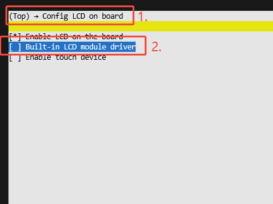

## 一、屏幕点亮的流程

在RT-Thread下,`littlevgl2rtt_init()`是LVGL图形库与RT-Thread操作系统对接的关键函数。当调用`littlevgl2rtt_init("lcd")`时，系统会完成以下初始化流程：

### 1. LVGL核心初始化

```c
lv_init()
```
这是LVGL的底层初始化函数，主要完成：
- 初始化LVGL内部数据结构
- 设置默认主题和样式
- 初始化内存管理系统
- 创建默认调色板和字体

### 2. 查找并打开显示设备

```c
rt_device_find("lcd")
rt_device_open(device, RT_DEVICE_OFLAG_RDWR)
```
通过设备名称"lcd"在RT-Thread设备驱动框架中查找已注册的LCD设备，并打开该设备。这里的"lcd"是在屏幕驱动注册时使用的设备名称。

### 3. 获取LCD设备信息

从RT-Thread设备中获取LCD的关键参数：
- **分辨率**：屏幕的宽度和高度（如240x240）
- **像素格式**：RGB565、RGB888等颜色格式
- **帧缓冲区地址**：显存的位置

### 4. 创建LVGL显示驱动

```c
lv_display_create(width, height)
```
创建LVGL的显示对象，设置：
- 显示分辨率
- 刷新缓冲区（draw buffer）
- 刷新回调函数

### 5. 分配显示缓冲区

为LVGL分配绘制缓冲区（draw buffer），有两种模式：
- **单缓冲**：一个缓冲区，LVGL渲染后直接发送到LCD
- **双缓冲**：两个缓冲区，一个用于渲染，一个用于传输，效率更高

缓冲区大小通常是屏幕分辨率的一部分，如1/10屏幕大小，以节省内存。

### 6. 注册刷新回调函数

```c
lv_display_set_flush_cb(display, disp_flush)
```
这是最关键的步骤，注册一个回调函数，当LVGL完成UI渲染后会调用这个函数将数据传输到LCD硬件：

```c
void disp_flush(lv_display_t *disp, const lv_area_t *area, uint8_t *px_map)
{
    // 将px_map中的像素数据写入LCD指定区域
    // 通过RT-Thread设备接口：rt_device_write()
    rt_device_write(lcd_device, ...);
    
    // 通知LVGL刷新完成
    lv_display_flush_ready(disp);
}
```

### 7. 创建LVGL刷新任务

littlevgl2rtt会创建一个RT-Thread任务，用于周期性调用LVGL的任务处理函数：

```c
lv_timer_handler()  // 每隔一定时间调用（如5ms）
```

这个任务负责：
- 处理UI动画
- 响应触摸输入（如果有）
- 刷新需要更新的屏幕区域
- 管理LVGL的定时器

### 8. 工作流程总结

```
应用代码调用LVGL API创建UI
    ↓
lv_timer_handler()检测到需要刷新
    ↓
LVGL在draw buffer中渲染UI
    ↓
调用disp_flush()回调函数
    ↓
通过RT-Thread设备接口写入LCD硬件
    ↓
屏幕显示更新的内容
```

### 9. 关键数据流

```
LVGL图形库 ←→ littlevgl2rtt适配层 ←→ RT-Thread设备驱动框架 ←→ LCD硬件驱动 ←→ 屏幕硬件
```

**举例说明**：
当你调用`lv_label_set_text(label, "Hello")`改变标签文本时：
1. LVGL标记该区域需要重绘
2. `lv_timer_handler()`检测到更新请求
3. LVGL在缓冲区中重新渲染标签
4. 调用`disp_flush()`将新数据传输到LCD
5. 屏幕上显示新的文本"Hello"

通过这种分层设计，应用开发者只需要调用LVGL的API，无需关心底层LCD硬件的具体操作细节。

## 二、运行rt_driver示例

打开sdk的`example/rt_driver`目录，按照README中的说明编译运行，可以看到屏幕点亮并显示几种测试图案。


## 三、添加新的屏幕驱动

### Kconfig简介

Kconfig是一种配置文件格式，源自Linux内核，用于定义软件系统的配置选项和依赖关系。在RT-Thread中，Kconfig文件定义了各种功能模块、驱动程序和参数的可配置项。

**主要语法元素**：

- **config**: 定义一个配置选项
  ```kconfig
  config LCD_USING_ST7789
      bool "Enable ST7789 LCD driver"
      default n
  ```

- **bool/int/string**: 配置项的数据类型
  - `bool`: 布尔类型（是/否）
  - `int`: 整数类型
  - `string`: 字符串类型

- **default**: 设置选项的默认值
  ```kconfig
  config LCD_HOR_RES_MAX
      int
      default 320
  ```

- **select**: 自动选择依赖项，当本选项被选中时，自动选中其他相关选项
  ```kconfig
  config LCD_USING_ZJY_ST7789_2_0
      bool "2.0 st7789"
      select LCD_USING_ST7789_8080
      select BSP_LCDC_USING_DBI
  ```

- **choice/endchoice**: 定义互斥选项组，只能选择其中一个
  ```kconfig
  choice
      prompt "Custom LCD driver"
      config LCD_USING_TYPE_A
          bool "LCD Type A"
      config LCD_USING_TYPE_B
          bool "LCD Type B"
  endchoice
  ```

- **if/endif**: 条件判断，只有条件满足时才显示内部选项
  ```kconfig
  if !BSP_USING_BUILT_LCD
      config LCD_USING_CUSTOM
          bool "Custom LCD"
  endif
  ```

**工作原理**：
Kconfig文件定义配置框架，当用户通过menuconfig工具选择配置后，系统会根据Kconfig的定义生成配置头文件（rtconfig.h），该头文件包含各种宏定义，编译时会根据这些宏决定哪些代码被编译进最终程序。

### Menuconfig简介

Menuconfig是一个基于终端的图形化配置界面，用于可视化地配置Kconfig定义的选项。通过Menuconfig，开发者无需手动编辑配置文件，而是通过友好的菜单界面进行选择和配置。

**启动方式**：

在RT-Thread项目目录下执行：
```bash
scons --menuconfig
```
或直接执行：
```bash
menuconfig
```

**操作方式**：

- **方向键（↑↓）**: 在菜单中上下移动光标
- **方向键（←→）**: 在底部按钮间切换（Select/Exit/Help等）
- **空格键**: 选中/取消选中当前选项
  - `[ ]` 未选中
  - `[*]` 已选中
  - `< >` 模块化编译（部分系统支持）
- **回车键**: 进入子菜单或确认选择
- **ESC键**: 返回上级菜单，连按两次可退出menuconfig
- **?键或H键**: 查看当前选项的帮助信息
- **/键**: 搜索配置项（输入关键词快速定位）

**配置流程**：

1. 启动menuconfig进入配置界面
2. 使用方向键浏览配置选项
3. 按回车进入需要配置的子菜单
4. 使用空格键选中或取消选中所需选项
5. 配置完成后，使用方向键选择底部的`Exit`按钮
6. 退出时选择`Yes`保存配置
7. 系统自动生成`rtconfig.h`配置头文件
8. 执行`scons`编译项目，新配置将生效

**配置文件生成**：

配置保存后，menuconfig会生成两个重要文件：
- **rtconfig.h**: C语言头文件，包含所有配置宏定义，供代码编译时使用
- **.config**: 配置文件，记录所有配置项的值，供下次打开menuconfig时恢复配置

**举例说明**：

当你在menuconfig中选中`LCD_USING_ZJY_ST7789_2_0`选项后：
1. rtconfig.h中会生成：`#define LCD_USING_ZJY_ST7789_2_0`
2. 由于该选项设置了`select LCD_USING_ST7789_8080`，所以也会生成：`#define LCD_USING_ST7789_8080`
3. 编译时，代码中通过`#ifdef LCD_USING_ZJY_ST7789_2_0`判断是否编译相关驱动代码
4. 最终只有被选中的屏幕驱动代码会被编译进固件

### 添加新的屏幕驱动步骤
添加屏幕驱动的方式有两种，一种是内置到sdk中，另一种是外置到工程中。这里介绍外置到工程中的方式，以st7789_dbi为例，步骤如下：
1. 首先复制一份rt_driver例程用于调试屏幕驱动。
2. 可以在`SDK\customer\peripherals`目录下找一个类似且已适配过的屏驱，这样可以参考它的驱动代码和屏幕参数配置。然后将该屏驱动文件夹复制到你的工程目录下。如果没有类似的屏驱动，也可以参考该目录下的屏幕驱动代码进行编写。
3. 修改驱动代码中的屏幕参数配置为你所使用的屏幕参数，比如分辨率、偏移、像素格式、初始化命令等。屏幕的初始化命令最好严格按照屏幕厂商提供的来写，以确保屏幕能够正确初始化。
4. 修改工程的`project/Kconfig.proj`文件，添加对新屏驱动的支持选项。
```
if !BSP_USING_BUILT_LCD

	config LCD_USING_ST7789_8080
		bool
		default n

	choice
        prompt "Custom LCD driver"
        default LCD_USING_ZJY_ST7789_2_0

        config LCD_USING_ZJY_ST7789_2_0            
            bool "2.0 st7789"
            select LCD_USING_ST7789_8080                  
            select BSP_LCDC_USING_DBI

    endchoice

    config LCD_HOR_RES_MAX
        int
	    default 320 if LCD_USING_ZJY_ST7789_2_0

    config LCD_VER_RES_MAX
        int
        default 240 if LCD_USING_ZJY_ST7789_2_0

    config LCD_DPI
        int
        default 235 if LCD_USING_ZJY_ST7789_2_0

endif
```
5. 修改SConscript文件，添加新屏驱动的编译规则。
```
objs.extend(SConscript(cwd+'/../st7789_8080/SConscript', variant_dir="st7789_8080", duplicate=0))
```
6. 运行menuconfig,先关闭内建的屏驱动选项：
    
然后启用你刚添加的屏驱动选项：
    
    
7. 编译复制rt_driver例程并下载工程到设备，如果驱动正常的话运行后即可看到屏幕点亮并显示测试图案。

## 四、常见的驱动异常及解决方法
### 1. 屏幕不点亮
- 检查屏幕供电是否正常，确保VCC和GND连接正确
- 检查屏幕连接线是否正确连接到开发板，尤其是数据线和控制线
- 确认屏幕初始化命令是否正确，参考屏幕厂商提供
- 检查屏幕背光控制引脚是否正确配置并使能
### 2. 屏幕显示异常（花屏、颜色错误等）
- 检查屏幕分辨率和像素格式配置是否正确
- 数据大小端序是否与屏幕要求一致
- 检查时序参数配置是否符合屏幕要求
### 3.出现屏幕显示不完整，偏移等问题
- 检查屏幕参数配置中的偏移值是否正确