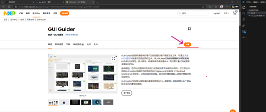
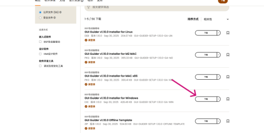
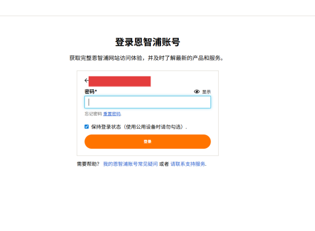
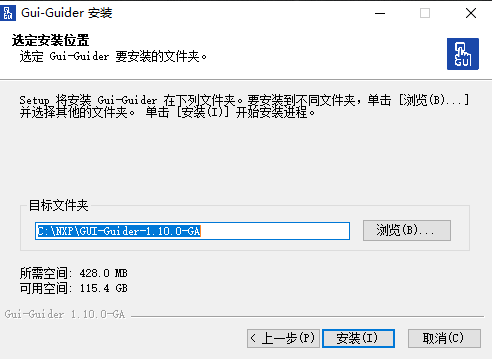
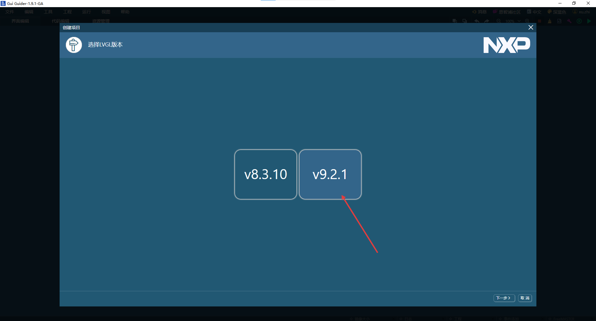
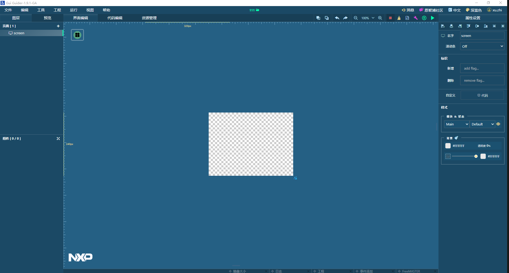
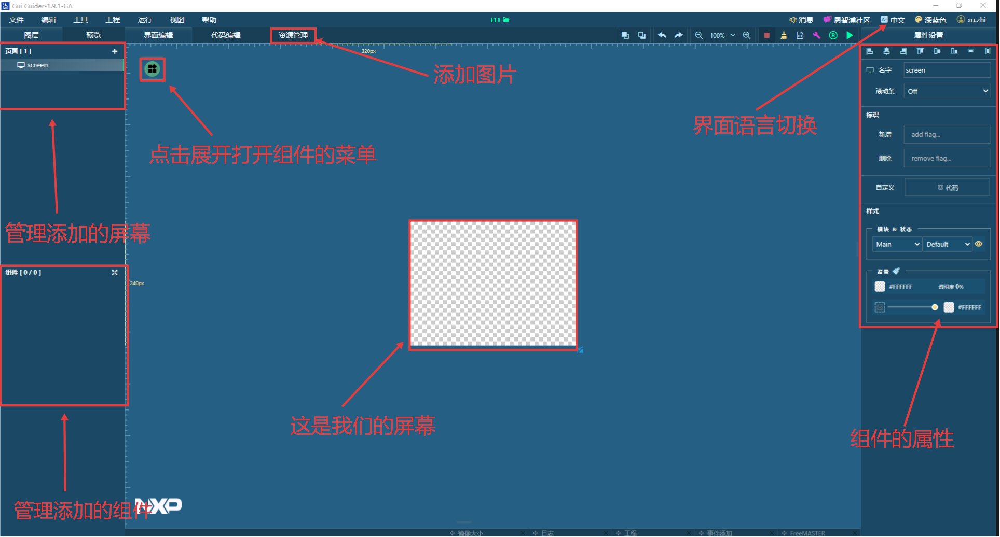

本文展示如何下载图形化LVGL编辑器，以及如何在编辑器中修改界面。
## 一、GUI-Guider下载

### 下载步骤

1. 打开浏览器，搜索"GUI-Guider"进入官方网站
2. 进入官网后，点击右上角的下载页面
   
3. 根据使用的操作系统选择对应版本（Windows系统选择Windows版本）
   
4. 登录NXP账号（如无账号需先注册），输入账号后点击登录
   
5. 输入密码后再次点击登录
   
6. 点击"我接受"同意许可协议
   
7. 等待文件下载完成

## 二、GUI-Guider安装

### 安装步骤

1. 双击安装包开始安装
2. 选择中文(简体)，点击OK
   
3. 点击"我同意"
   
4. 点击"下一步"
   
5. 点击"安装"（安装路径默认为C盘，如需修改可自行调整）
   
6. 等待安装完成，点击"完成"
   至此GUI-Guider安装完成

## 三、GUI-Guider工程创建

### 创建步骤

1. 双击打开GUI-Guider，使用之前登录的账号登录
2. 点击"创建新项目"
   
3. 选择LVGL 9
   
4. 点击"Simulator"进入
   
5. 点击"emptyUI"进入
   
6. 输入工程名称（如xty_pre），选择工程存放目录，面板类型选择320*240，点击"创建"
   
7. 点击"创建"完成工程创建
   

## 四、GUI-Guider界面介绍

图中展示了GUI-Guider的核心界面模块，各区域的位置与功能如下：

### 1. 左侧区域：屏幕与组件管理区

- **屏幕管理**：对应图中"管理添加的屏幕"区域，用于创建、删除、切换不同的界面屏幕
- **组件管理**：对应图中"管理添加的组件"区域，可查看当前屏幕内已添加的所有组件列表，支持组件的批量管理

### 2. 顶部功能栏：核心操作入口

- **资源管理**：对应图中"资源管理"标签，用于导入、管理界面所需的图片、字体等资源
- **界面编辑/代码编辑**：支持可视化设计与代码编辑的切换

### 3. 中间界面编辑区：可视化设计画布

- **屏幕区域**：对应图中"这是我们的屏幕"标识的区域，是界面设计的核心画布
- **组件菜单入口**：对应图中"点击展开打开组件的菜单"标识的绿色图标按钮，点击后可展开组件库

### 4. 右上角区域：工具设置入口

- **界面语言切换**：对应图中"界面语言切换"标识的区域，支持切换GUI-Guider工具的显示语言

### 5. 右侧属性设置区：组件个性化配置区

- 对应图中"组件的属性"标识的区域，选中组件后可设置样式、名称、标识等属性

## 五、添加组件

### 操作步骤

1. 选中屏幕，在属性设置中设置背景透明度
   
2. 点击左上角的组件菜单入口，下滑找到数字时钟，单击或拖动添加到屏幕
   在右侧属性设置中设置X,Y坐标为0，高度和宽度为40,320，选择第一个预设样式
   
3. 从组件菜单中添加日期，在右侧属性设置中设置X,Y坐标为0,200，高度和宽度为40,320，预设样式选择第三个
4. 从组件菜单中添加容器，在右侧属性设置中设置X,Y坐标为5,60，高度和宽度为120,240，预设样式选择第三个，边框颜色设置为黑色
5. 从组件菜单中添加标签，在左侧下方的组件中，将添加的标签拖动放入容器中
   在右侧属性设置中设置X,Y坐标为0,0，高度和宽度为50,30，设置边框颜色并设置边框宽度为2
6. 选中刚才放置的标签，通过Ctrl+C进行复制，再使用Ctrl+V粘贴5个相同的标签，并进行简单的对齐
   
7. 从组件菜单中添加图片，放置在容器的右侧，点击顶部功能栏的资源管理，选择导入图片（导入的图片不能使用中文名称），选择想要添加的图片
8. 将导入的图片转换为.c文件，选择导入的图片，点击转换图片
   输出格式选择C，Binary格式选择RGB565，抖动算法选择None，图形格式选择CF_TRUE_COLOR，点击确定
   
9. 设置图片组件的图像源，回到界面编辑中，双击图片组件，选择刚才添加的图片
10. 通过右侧属性设置的布局操作对6个标签进行对齐处理，在对齐后双击标签设置标签的文本内容，分别为A,B,C,D,E,F
11. 最后点击右上角的三角形，选择C进行模拟，等待编译完成即可看到制作的界面
    
