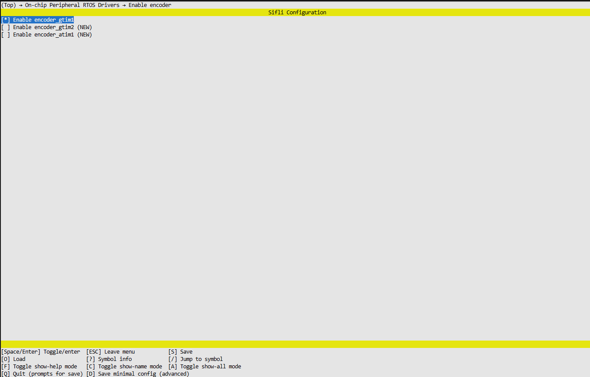

## 一、旋转编码器介绍

旋转编码器是一种能够将**机械旋转动作**转换为对应**电信号**的精密传感器，核心用途是测量旋转角度、旋转速度，也常在嵌入式设备中实现菜单切换、参数调节、音量控制等交互式操作。

根据输出信号的形式，旋转编码器主要分为两类：

1. **绝对式编码器**：输出与旋转位置一一对应的唯一编码信号，断电后不会丢失位置信息，适合高精度定位、多档位切换等场景，成本相对较高。
2. **增量式编码器**：输出两路相位差90°的脉冲信号，通过对脉冲进行计数可获取旋转角度，通过判断两路脉冲的相位先后可获取旋转方向，具有结构简单、成本低廉、实时性好的特点，在嵌入式系统中应用更为广泛。

## 二、menuconfig配置

在编写代码前，需先通过`menuconfig`工具开启工程的编码器驱动支持，操作步骤如下：

### 步骤1：准备工作

1. 确保已完整搭建该工程的编译环境，且环境变量配置正常。
2. 打开终端（CMD/终端工具），通过`cd`命令切换到工程的`project`文件夹下（示例：`cd /xxx/xiaozhi/project`），确保终端当前工作路径为`project`目录。

### 步骤2：执行menuconfig配置命令

在终端中输入以下完整命令，回车后进入图形化配置界面：

```bash
scons --board=sf32lb52-xty-ai_hcpu --menuconfig
```

### 步骤3：开启编码器相关驱动

1. 进入图形化配置界面后，通过**方向键↑/↓**移动光标，选中`RTOS Drivers`选项，按下**回车键**进入子菜单。
2. 在`RTOS Drivers`子菜单中，找到`encoder`（编码器驱动）选项，按下**空格键**勾选该选项（勾选后前方会出现`*`，表示已使能）。
3. 保持`encoder`选项处于选中状态，按下**回车键**进入编码器详细配置子菜单。
4. 在详细配置子菜单中，找到`encoder_gtim1`（基于GPTIM1的编码器驱动）选项，按下**空格键**勾选该选项，完成具体驱动通道的使能。
5. 配置完成后，按下**D键**保存当前配置（无需修改保存路径，默认保存即可），随后多次按下**Q键**退出图形化配置界面，直至返回终端命令行。



## 三、旋转编码器代码编写

### 3.1 新建文件与头文件准备

编码器的代码需单独封装，便于后续维护和复用，我们将创建对应的头文件和源文件，并完成基础配置。

#### 步骤1：创建源文件和头文件

在工程的`src`文件夹下，新建两个文件，文件命名和用途如下：

- 头文件：`encoder_siq.h`（核心用途：定义宏常量、声明函数、声明外部全局变量，避免代码重复定义和未声明错误）
- 源文件：`encoder_siq.c`（核心用途：实现编码器初始化、定时器配置、计数读取等核心逻辑，是编码器功能的具体实现载体）

#### 步骤2：编写头文件`encoder_siq.h`

该头文件的核心是“声明”，不做具体功能实现，完整代码和细致讲解如下：

```c
#ifndef ENCODER_SIQ_H
#define ENCODER_SIQ_H

#include <rtthread.h>  

/* 编码器设备名称定义：必须与menuconfig配置的编码器设备名称一致（此处为encoder1），
   否则后续无法通过设备名称查找到编码器设备，会导致初始化失败 */
#define ENCODER_DEVICE_NAME1 "encoder1"

/* 函数声明：提前声明后续要在encoder_siq.c中实现的函数，
   方便其他文件（如main.c）引入该头文件后调用对应的函数 */
rt_err_t encoder_example_init(void);  // 编码器整体初始化函数（引脚、设备、定时器配置）
void Get_count(void* argv);           // 定时器回调函数（周期性读取编码器计数值）

#endif /* ENCODER_SIQ_H */
```


#### 步骤3：引入源文件必要头文件

在`encoder_siq.c`文件的开头，引入实现编码器功能所需的所有头文件，确保代码中调用的接口都有对应的声明支持，完整代码如下：

```c
#include "encoder_siq.h"              
#include <rtdevice.h>                  
#include <drv_gpio.h>                  
#include <drv_encoder.h>              
```


### 3.2 编写编码器初始化函数

`encoder_example_init`函数是编码器正常工作的基础，核心完成**引脚配置、周期性定时器创建、编码器设备查找、编码器设备使能**四大核心功能，逐步骤细致讲解如下：

#### 步骤1：定义全局变量

在`encoder_siq.c`文件中，定义全局变量，代码和说明如下：

```c
#define ENCODER_DEVICE_NAME1 "encoder1"  // 编码器设备名称（与头文件保持一致，确保设备查找匹配）

struct rt_device *encoder_device1;       // 编码器设备句柄（类似设备“身份证”），后续所有对encoder1的操作都需通过该句柄实现
rt_timer_t read_counter_timer = RT_NULL; // 定时器句柄，用于管理周期性定时器，后续通过该句柄启动/停止定时器
```

#### 步骤2：GPIO引脚配置

根据工程原理图，旋转编码器的A相（脉冲1）对应`PA38`引脚，B相（脉冲2）对应`PA40`引脚，需将这两个引脚配置为`GPTIM1`的通道1和通道2，并开启上拉电阻，代码和说明如下：

```c
// 配置编码器A、B相对应的GPIO引脚，绑定至GPTIM1对应的通道，并开启上拉电阻
HAL_PIN_Set(PAD_PA38, GPTIM1_CH1, PIN_PULLUP, 1);  // A相：PA38 → GPTIM1_CH1，开启上拉电阻（使能标记为1）
HAL_PIN_Set(PAD_PA40, GPTIM1_CH2, PIN_PULLUP, 1);  // B相：PA40 → GPTIM1_CH2，开启上拉电阻（使能标记为1）
```


#### 步骤3：完整初始化函数实现

在完成引脚配置和全局变量定义后，编写完整的初始化函数，每个步骤都附带明确的功能说明，代码如下：

```c
rt_err_t encoder_example_init(void)
{
    rt_err_t result1;  // 用于接收各类接口调用的返回值，通过返回值判断操作是否成功（RT_EOK为成功）

    // 步骤1：配置编码器A、B相GPIO引脚（绑定定时器通道+开启上拉）
    HAL_PIN_Set(PAD_PA38, GPTIM1_CH1, PIN_PULLUP, 1);  
    HAL_PIN_Set(PAD_PA40, GPTIM1_CH2, PIN_PULLUP, 1);  

    // 步骤2：创建周期性定时器，用于定期读取编码器计数值
    // 参数说明：
    // 1. 定时器名称：read_counter_timer（自定义，便于调试识别）
    // 2. 回调函数：Get_count（定时器超时后执行的函数，即计数读取函数）
    // 3. 回调参数：RT_NULL（此处无需传递参数，填空）
    // 4. 定时时长：1000ms（每隔1秒读取一次计数，可根据需求调整）
    // 5. 定时器模式：RT_TIMER_FLAG_PERIODIC（周期性定时器，超时后自动重启，持续执行回调函数）
    read_counter_timer = rt_timer_create("read_counter_timer", Get_count, RT_NULL, 1000, RT_TIMER_FLAG_PERIODIC);

    // 步骤3：根据设备名称查找编码器设备，获取设备句柄
    encoder_device1 = rt_device_find(ENCODER_DEVICE_NAME1);
    if (encoder_device1 == RT_NULL)  // 判读设备是否查找成功（句柄为NULL表示查找失败）
    {
        rt_kprintf("Failed to find %s device\n", ENCODER_DEVICE_NAME1);  // 打印错误信息，便于调试排查
        return -RT_ERROR;  // 返回错误码，告知调用者初始化失败
    }

    // 步骤4：配置编码器参数并使能编码器设备
    struct rt_encoder_configuration config1;  // 编码器配置结构体，用于存储编码器的配置参数
    config1.channel = GPT_CHANNEL_ALL;        // 配置编码器使用所有可用通道（此处为GPTIM1_CH1和CH2，对应A、B相）

    // 发送设备控制命令，使能编码器设备
    // 参数说明：
    // 1. 设备句柄：encoder_device1（已获取的编码器设备句柄）
    // 2. 控制命令：PULSE_ENCODER_CMD_ENABLE（编码器驱动预定义，用于使能编码器设备）
    // 3. 配置参数：&config1（编码器配置结构体地址，传递配置参数）
    result1 = rt_device_control((struct rt_device *)encoder_device1, PULSE_ENCODER_CMD_ENABLE, (void *)&config1);
    if (result1 != RT_EOK)  // 判断编码器是否使能成功（RT_EOK表示成功，非0表示失败）
    {
        rt_kprintf("Failed to enable encoder\n");  // 打印错误信息，便于调试排查
        return -RT_ERROR;  // 返回错误码，告知调用者初始化失败
    }

    // 步骤5：打印初始化成功信息，并启动周期性定时器
    rt_kprintf("Encoder devices initialized successfully\n");
    rt_timer_start(read_counter_timer);  // 启动定时器，开始周期性执行Get_count回调函数

    return RT_EOK;  // 返回成功码，告知调用者编码器初始化完成且正常
}
```

### 3.3 编写定时器回调函数`Get_count`

`Get_count`是定时器的超时回调函数，会按照定时器设定的时长（1000ms）周期性执行，核心功能是**读取编码器当前累计计数值**，并进行错误处理和计数打印，完整代码和细致讲解如下：

```c
void Get_count(void*argv)
{
    // 1. 定义变量
    static int last_count1 = 0;  // 静态局部变量：仅第一次执行函数时初始化为0，后续保留上一次的赋值结果（预留用于判断旋转方向/增量）
    int count1 = 0;              // 普通局部变量：临时存储当前计数值（预留用于后续计数处理，如范围限制、增量计算）

    rt_err_t result1;            // 错误状态变量：接收设备控制接口返回值，判断计数读取是否成功

    struct rt_encoder_configuration config_count1;  // 编码器配置/数据回传结构体：用于接收读取到的计数值

    config_count1.get_count = 0;  // 初始化计数值存储成员：避免结构体成员携带脏数据（内存残留随机值），保证计数读取准确性

    // 2. 核心操作：读取编码器当前累计计数值
    // 参数说明与初始化函数一致，仅控制命令改为PULSE_ENCODER_CMD_GET_COUNT（用于读取计数值）
    result1 = rt_device_control((struct rt_device *)encoder_device1, PULSE_ENCODER_CMD_GET_COUNT, (void *)&config_count1);

    // 3. 结果处理：判断读取成败并输出对应信息
    if (result1 != RT_EOK)
    {
        // 读取失败：打印错误提示，便于排查问题（如设备未使能、句柄无效等）
        rt_kprintf("Failed to get encoder count\n");
    }
    else{
        // 读取成功：打印当前累计计数值，config_count1.get_count中存储了有效计数结果
        // 旋转方向说明：顺时针旋转，计数值递增；逆时针旋转，计数值递减
        rt_kprintf("Count:%d\n", config_count1.get_count);
    }
}
```

## 四、编译下载与效果验证

完成代码编写后，需通过编译、烧录、串口查看三个步骤验证编码器功能是否正常，具体操作如下：


1. 打开工程的`main.c`文件，在文件开头引入编码器头文件，获取初始化函数声明：

    ```c
    #include "encoder_siq.h"  // 引入编码器头文件
    ```

2. 在`main`函数中，调用`encoder_example_init`函数，完成编码器初始化（建议放在main函数开头，系统启动后即初始化）：

    ```c
    int main(void)
    {
        // 其他初始化代码...
        
        // 调用编码器初始化函数
        encoder_example_init();
        
        // 其他代码...
        while(1)
        {

        }
    }
    ```

3. 到这里即可将工程编译下载到开发板查看效果。

