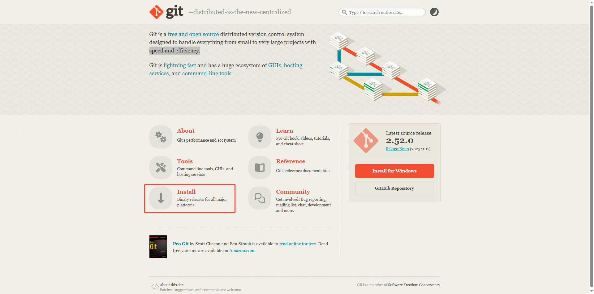
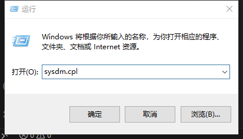
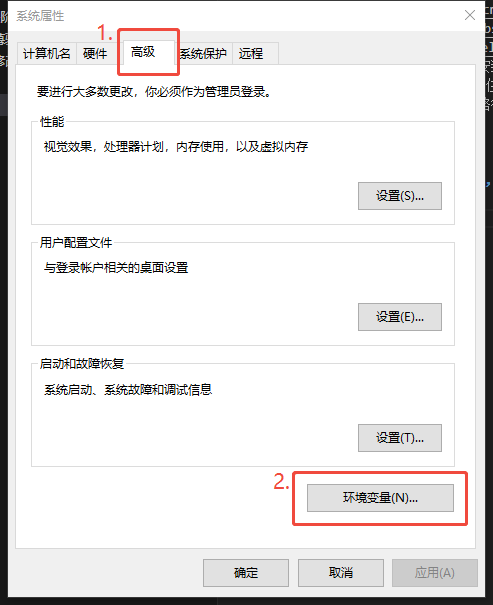
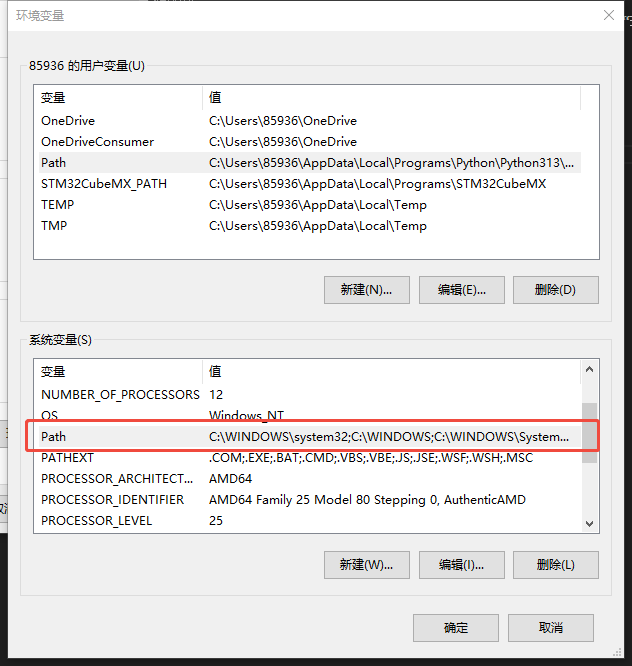
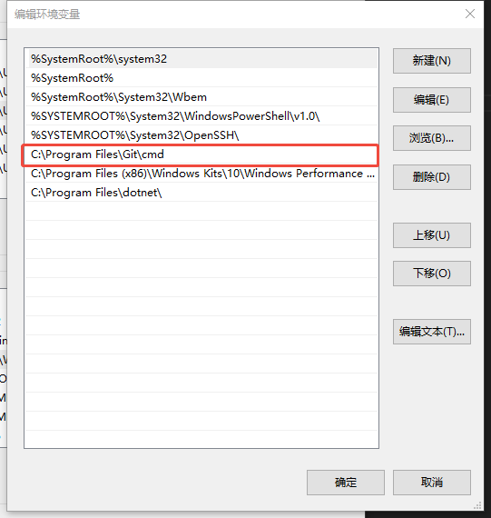
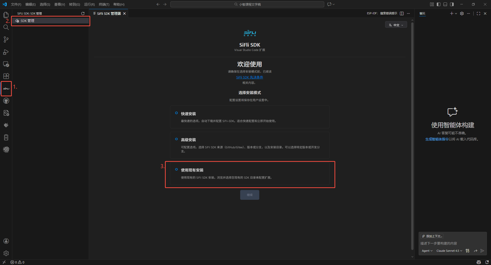
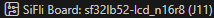
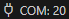
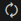
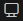

## 下载并安装git

1. 到git官网(https://git-scm.com/),点击Install按钮，下载系统对应的安装包。


2. 双击安装包，按照默认选项安装即可。
3. 将git添加到环境变量中。按住Win+R键，搜索sysdm.cpl，打开系统属性窗口，选择“高级”选项卡，点击“环境变量”按钮。在“系统变量”中找到Path变量，双击打开，在变量值的末尾添加git的安装路径（例如C:\Program Files\Git\cmd），点击确定保存即可。





## 选择适合你的代码仓库

小智项目提供了两个代码托管平台供用户选择：

### 1. GitHub 仓库

- **仓库地址**：<https://github.com/OpenSiFli/xiaozhi-sf32>
- **特点**：这是项目的主仓库，更新最及时，适合能够顺畅访问GitHub的国际用户或国内拥有科学上网手段的用户。

### 2. Gitee 镜像仓库（国内用户推荐）

- **仓库地址**：<https://gitee.com/SiFli/xiaozhi-sf32>
- **特点**：这是GitHub仓库的国内镜像，访问速度快，无需特殊网络环境，特别适合中国大陆地区的用户使用。

**选择建议**：如果你在国内且访问GitHub较慢或经常超时，强烈建议使用Gitee镜像仓库，这将大大提升你的下载速度和开发体验。

## 二、拉取主仓库代码

### 方法一：从GitHub拉取（国际用户）

打开你的终端或命令行工具，切换到希望存放项目的目录，然后执行以下命令：

```bash
git clone https://github.com/OpenSiFli/xiaozhi-sf32.git
```

这条命令会在当前目录下创建一个名为 `xiaozhi-sf32` 的文件夹，并将主仓库的所有文件下载到该文件夹中。

### 方法二：从Gitee拉取（国内用户）

同样在终端中执行：

```bash
git clone https://gitee.com/SiFli/xiaozhi-sf32.git
```

此命令会从Gitee镜像仓库拉取代码，速度通常会比从GitHub拉取快很多。

## 子模块（Submodule）

完成上述步骤后，你可能会进入 `xiaozhi-sf32` 文件夹查看，然后发现一个奇怪的现象：`sdk` 文件夹是空的！这不是错误，而是Git子模块的特殊设计。

### 什么是子模块？

子模块是Git中的一种机制，允许你将一个Git仓库作为另一个Git仓库的子目录。这样做的好处是能够让你在主项目中保持对另一个项目的特定提交的引用。在小智项目中，SDK（软件开发工具包）就是一个独立的Git仓库，它作为子模块被主项目引用。

### 为什么需要子模块？

1. **代码复用**：SDK可能被多个项目共享使用
2. **版本控制**：主项目可以锁定SDK的特定版本，确保兼容性
3. **分离关注点**：主项目代码和底层SDK代码可以独立开发和维护

简单来说，小智项目就像一辆汽车，而SDK就像是汽车的发动机。我们刚刚拉取的只是汽车的框架，还需要安装发动机（SDK）才能让汽车正常运行。

## 初始化子模块

### 针对GitHub用户的两种方法

#### 方法一：拉取时自动初始化（推荐）

如果你还没有拉取代码，或者可以重新拉取，最简便的方法是在克隆命令中添加 `--recursive` 参数：

```bash
git clone --recursive https://github.com/OpenSiFli/xiaozhi-sf32.git
```

这个参数的作用是告诉Git在克隆主仓库后，**递归地**初始化并更新所有子模块。`--recursive` 参数确保如果子模块本身还包含子模块（多层嵌套），也会被一并处理。

#### 方法二：拉取后手动初始化

如果你已经使用普通方式克隆了仓库，可以进入项目目录后执行：

```bash
cd xiaozhi-sf32
git submodule update --init --recursive
```

这条命令的含义是：

- `git submodule update`：更新子模块
- `--init`：如果子模块尚未初始化，则进行初始化
- `--recursive`：递归处理所有嵌套的子模块

### 针对Gitee用户的特殊处理

由于Gitee镜像仓库中的子模块配置指向的是GitHub地址，而国内访问GitHub可能受限，因此需要额外的配置步骤：

1. **首先，普通克隆仓库（不要加 `--recursive` 参数）**：

   ```bash
   git clone https://gitee.com/SiFli/xiaozhi-sf32.git
   ```

2. **进入项目目录并编辑子模块配置**：

   ```bash
   cd xiaozhi-sf32
   ```

   使用文本编辑器打开 `.gitmodules` 文件，你会看到类似以下内容：

   ```ini
   [submodule "sdk"]
       path = sdk
       url = ../../OpenSiFli/SiFli-SDK.git
   ```

   这个配置指向的是相对GitHub路径，需要将其修改为Gitee的SDK镜像地址：

   ```ini
   [submodule "sdk"]
       path = sdk
       url = https://gitee.com/SiFli/sifli-sdk.git
   ```

   保存文件。

3. **执行子模块初始化**：

   ```bash
   git submodule update --init --recursive
   ```

   现在Git会从Gitee镜像拉取SDK子模块，速度会快很多。

## 安装vscode插件
下面讲述如何安装vscode插件，并把初始化好的SDK导入vscode插件
1. 打开vscode，点击左侧扩展图标，搜索sifli-sdk-codekit，点击安装。

2. 安装完成后，点击左侧sifli图标，点击"SDK管理"，可以看到三个选项：
 - 快速安装
 - 高级安装
 - 使用现有安装

3. 选择"使用现有安装"，选择工具链下载源，在SDK容器目录选择已经初始化好的SDK路径，点击"安装并配置 SDK"按钮，等待安装完成即可。


## 2.进入sdk的examples目录，编译hello_world示例

1. 用vscode打开SDK目录下的example/get-started/rtt/hello_world工程文件夹。此时插件会自动识别该工程，并准备好编译环境。
2. 等待插件准备完毕，下边栏会出现一排图标，分别是：
 - 管理SDK安装
    
 - 选择SDK版本
    
 - 当前芯片模组
    
 - 当前串口配置
    
 - 执行构建
    
 - 清理构建文件并重新构建
    
 - 清理构建文件
    
 - 执行烧录
    
 - 打开menuconfig配置界面
    
 - 监视设备
    
3. 选择好使用的SDK版本和芯片模组后，点击“执行构建”图标，等待编译完成即可。

## 3.下载后查看串口日志

1. 将芯片模组通过串口线连接到电脑上，在下边栏选择好对应的串口号和波特率后，点击执行烧录图标，等待烧录完成即可。
2. 烧录完成后，点击监视设备图标，即可查看串口日志。


## 使用命令行安装
除了使用vscode安装环境，我们也可以使用命令进行操作。如果你仅想使用vscode安装和编译程序，可以跳过本内容。

#### 1. 打开 PowerShell 终端

首先，我们需要打开 PowerShell 终端。可以通过以下方式之一打开：

- 在文件资源管理器地址栏中输入 `powershell` 后按回车
- 在开始菜单中搜索 "PowerShell" 并打开
- 使用快捷键 `Win + X`，然后选择 "Windows PowerShell"

#### 2. 导航到 SDK 目录

在 PowerShell 中，使用以下命令进入 SDK 目录（请根据您的实际路径自行调整）：

```powershell
cd xiaozhi-sf32\sdk
```

#### 3. 执行工具链安装脚本

在 SDK 目录中，执行安装脚本：

```powershell
.\install.ps1
```

如果系统提示执行策略限制，需要先允许脚本执行：

```powershell
Set-ExecutionPolicy -Scope CurrentUser -ExecutionPolicy RemoteSigned
```

然后再次运行安装脚本：

```powershell
.\install.ps1
```

#### 4. 使用国内镜像加速

由于国内访问 GitHub 和 Python 官方源可能较慢，建议使用国内镜像加速安装：

```powershell
$env:SIFLI_SDK_GITHUB_ASSETS="downloads.sifli.com/github_assets"
$env:PIP_INDEX_URL="https://mirrors.ustc.edu.cn/pypi/simple"
.\install.ps1
```

安装脚本执行完成后，终端会提示您运行 `export.ps1` 脚本。这一步至关重要，因为它将工具链的路径添加到系统的环境变量中，确保您可以在任何位置使用这些开发工具。


### 设置环境变量

#### 执行环境变量设置脚本

```powershell
.\export.ps1
```

执行完成后将会有以下提示：


#### 验证 Hello World 项目编译

为了全面验证开发环境，我们可以尝试编译一个 Hello World 示例。首先，导航到示例项目目录：

```powershell
cd example\get-started\hello_world
```

然后执行编译命令：

```powershell
scons --board=sf32lb52-xty-ai --board_search_path="..\..\..\..\..\..\app\boards" -j16
```