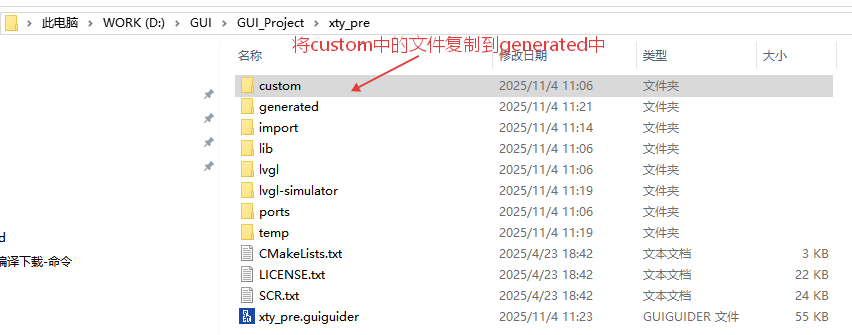
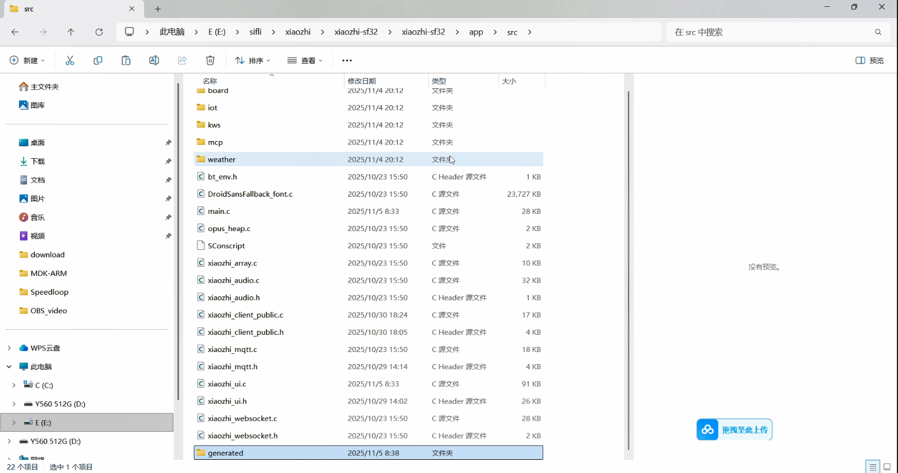
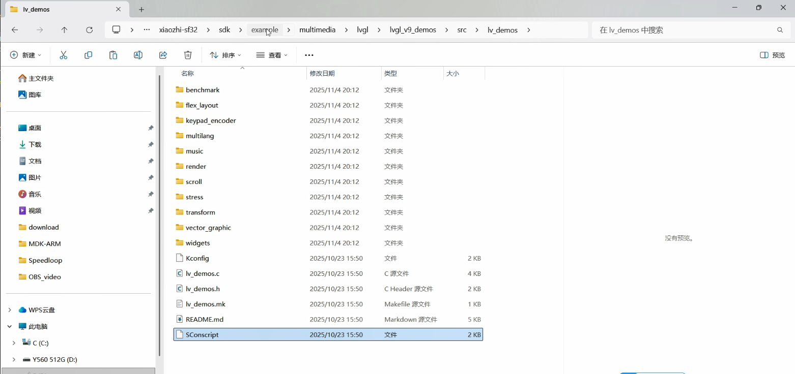
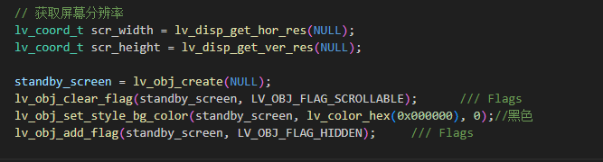

本节展示如何将生成的代码移植到工程中，编译下载
## 一、准备工作

1. **复制自定义文件**：打开GUI-Guider工程目录，将`custom`目录下的所有文件复制到`generated`文件夹中
   

2. **复制生成的文件**：将`generated`文件夹完整复制到小智工程的`app/src`目录下
   

3. **获取SConscript文件**：在小智工程的SDK目录中，找到路径`xiaozhi-sf32/sdk/example/multimedia/lvgl/lvgl_v9_demos/src/lv_demos`，将其中的`SConscript`文件复制到`generated`文件夹中
   

## 二、工程配置

1. **打开工程**：使用VS Code打开小智工程，并导航到`app`目录

2. **修改构建配置**：打开`project`文件夹下的`SConscript`文件，添加以下构建配置代码：

```bash
# GUI-Guider集成配置
objs.extend(SConscript(cwd+'/../src/generated/SConscript', variant_dir="generated", duplicate=0))
```

## 三、代码修改

1. **声明UI变量**：在`generated`文件夹下的`gui_guider.c`文件中添加全局UI变量声明：

```c
lv_ui guider_ui;
```

2. **添加头文件引用**：在`xiaozhi_ui.c`文件中添加GUI-Guider的头文件引用：

```c
#include "../generated/gui_guider.h"
```

3. **初始化GUI界面**：使用Ctrl+F搜索`xiaozhi_ui_obj_init`函数，在小智UI界面初始化完成后添加GUI-Guider的界面设置代码：

```c
setup_ui(&guider_ui);
```


4. **隐藏原有界面**：为了确保新添加的界面能够正常显示且不影响原有功能，需要在`xiaozhi_ui_obj_init`函数中添加代码来隐藏原有的界面：

```c
lv_obj_add_flag(standby_screen, LV_OBJ_FLAG_HIDDEN);
```



## 四、编译与下载

完成以上所有步骤后，即可进行工程编译并将生成的固件下载到开发板中进行测试。
