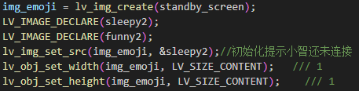
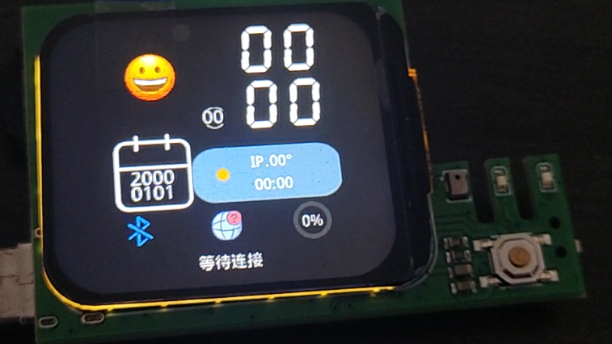

本节主要说明界面基本概念：布局、分辨率、DPI，以及对其进行简单的修改，修改之后重新编译下载查看效果。
## 一、布局、分辨率、DPI的概念

### 1.1 布局（Layout）

布局是指UI界面中各元素的排列方式和相对位置关系。在小智工程中，UI布局通过坐标和尺寸来控制每个控件的位置和大小。合理的布局设计需要考虑以下几点：

- **层次结构**：UI元素通常以父子关系组织，父容器影响子控件的位置和可见性
- **坐标系**：以屏幕左上角为原点(0,0)，向右为X轴正方向，向下为Y轴正方向
- **定位方式**：可以使用绝对定位（设置具体坐标）或相对定位（相对于父容器或其他控件）

### 1.2 分辨率（Resolution）

分辨率指显示屏在水平和垂直方向上的像素数量。小智工程使用的显示屏分辨率为320×240像素。这意味着：
屏幕宽度：320像素
屏幕高度：240像素
屏幕中心点坐标：(160, 120)
修改UI时需要确保所有元素都在(0,0)到(320,240)的范围内

### 1.3 DPI（Dots Per Inch）

DPI表示每英寸的像素数量，影响显示的细腻程度。虽然小智工程使用固定的物理显示屏，但在代码中通过`g_scale`缩放因子来适配不同DPI需求的显示效果：

- `g_scale`是一个全局缩放因子
- 使用`LV_SCALE_NONE * g_scale`来统一控制所有UI元素的缩放
- 这样可以保持UI在不同DPI设置下的一致性

## 二、打开小智工程

### 2.1 打开工程

首先，请确认已正确导航至小智工程所在的目录。我们使用VSCode打开该工程文件夹。启动VSCode后，可以在资源管理器侧边栏就能清晰看到完整的项目文件结构。

### 2.2 打开UI文件

在小智工程的众多文件中，xiaozhi_ui.c是承载主界面核心逻辑实现的关键文件，里面包含了主界面所有UI元素的定义、布局逻辑和用户交互处理代码。
你可以使用快捷键Ctrl+F打开搜索功能，输入xiaozhi_ui_obj_init就能快速精准定位到代码区域。

### 2.3 UI初始化函数

xiaozhi_ui_obj_init函数是小智主界面UI初始化的核心入口哦。在这个函数里，系统会自动创建并配置所有可见的UI控件，比如图像、按钮、文本标签等。
所以，不管是修改主界面的外观还是布局，都建议在这个函数或它调用的子函数中进行。

## 三、代码修改

### 3.1 替换图片内容

这里我们首先将小智主界面的sleep表情替换为funny表情，我们需要通过`lv_img_set_src()`这个函数去修改图像源。


### 3.2 调整缩放大小

这里我们通过调整图像的缩放大小去改变图片的大小，需要对`lv_img_set_zoom`中的参数进行修改，这里我们把图片缩小到原来的一半。
这里为保证不影响其他组件的大小，我们这里在缩放参数前乘以0.5即可。

```c
lv_img_set_zoom(img_emoji, (int)(0.5*LV_SCALE_NONE * g_scale)); // 根据缩放因子缩放

```

### 3.3 调整图片位置

这里我们通过调整表情和时间图片的x轴坐标来交换图片的位置。

```c

    img_emoji = lv_img_create(standby_screen);
    LV_IMAGE_DECLARE(sleepy2);
    LV_IMAGE_DECLARE(funny2);
    lv_img_set_src(img_emoji, &sleepy2);//初始化提示小智还未连接
    lv_obj_set_width(img_emoji, LV_SIZE_CONTENT);   
    lv_obj_set_height(img_emoji, LV_SIZE_CONTENT);  
    lv_obj_set_x(img_emoji, (int)(-1*104 * g_scale)); //x坐标乘以-1
    //...

    hour_tens_img = lv_img_create(standby_screen);
    LV_IMAGE_DECLARE(img_1);
    //...
    lv_obj_set_x(hour_tens_img, (int)(-1*142 * g_scale));//x坐标乘以-1
    //...

    hour_units_img = lv_img_create(standby_screen);
    LV_IMAGE_DECLARE(img_2);
    //...
    lv_obj_set_x(hour_units_img, (int)(-1*73 * g_scale));//x坐标乘以-1
    //...

    minute_tens_img = lv_img_create(standby_screen);
        LV_IMAGE_DECLARE(img_3);
    //...
    lv_obj_set_x(minute_tens_img, (int)(-1*142 * g_scale));//x坐标乘以-1
    //...

    minute_units_img = lv_img_create(standby_screen);
            LV_IMAGE_DECLARE(img_4);
    //...
    lv_obj_set_x(minute_units_img, (int)(-1*73 * g_scale));//x坐标乘以-1
    //...

```

## 四、下载编译以及实际效果

修改完成后，我们就可以将代码编译下载到开发板，查看修改后的实际效果。
如图就是最终效果:

