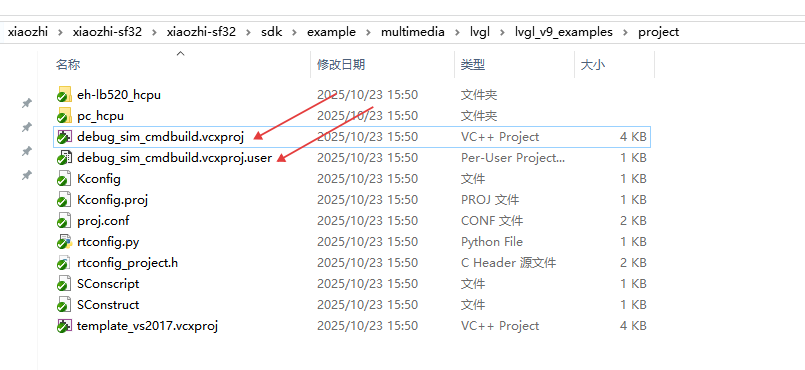
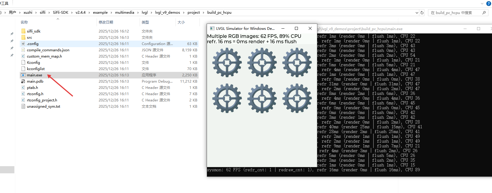

## 一、环境配置

LVGL 模拟器需要预先安装 Visual Studio 2017 社区版，请从 Visual Studio 官网下载并安装。

## 二、文件准备

1. **复制文件**：打开 SDK 目录 `example/multimedia/lvgl/lvgl_v9_examples/project`，将名为 `debug_sim_cmdbuild` 的两个文件复制到目标工程的 `project` 文件夹中。

   

2. **示例工程配置**：以 `lvgl_v9_demos` 为例，将复制的文件粘贴到其 `project` 文件夹下。

## 三、编译与运行

1. **打开工程**：使用 VS Code 打开目标工程。

2. **编译命令**：将编译命令中的开发板参数替换为 `pc`：

   ```bash
   scons --board=pc -j8
   ```

3. **运行程序**：编译完成后，在 `project/build_pc_hcpu` 目录下会生成 `main.exe` 可执行文件。双击运行即可查看 LVGL 程序的模拟效果。

   


