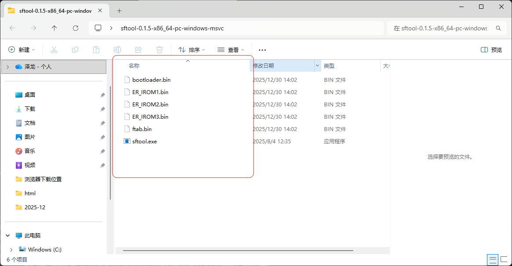

在开始之前，我们需要进行一些前置工具，请确保完成以下的步骤：

1. [sftool](sftool.md): 用于SF32系列SoC芯片的烧录

2. 下载固件：
开发板的固件位于 <https://github.com/78/xiaozhi-sf32/releases>，我们下载最新release版本的压缩包(1.4.0之前的版本)。需要注意的是，我们一共需要`bootloader.bin`、`ftab.bin`、`ER_IROM1.bin`、`ER_IROM2.bin`、`ER_IROM3.bin`这五个文件。
建议先下载sftool工具，下载完成后将这五个文件放在sftool文件夹中

 

3. 开发板对应固件：
SF32LB52-DevKit-ULP（黄山派）: sf32lb52-lchspi-ulp.zip
SF32LB52-DevKit-LCD: sf32lb52-lcd_n16r8.zip
SF32LB52-DevKit-Nano: sf32lb52-nano_52j.zip
小汤圆直插版（立创训练营）: sf32lb52-xty-ai-tht.zip

## 烧录固件

使用[sftool工具](../sftool.md)烧录固件，打开终端之后输入如下命令（Windows）：
!!!需要注意的是：命令中的 ./sftool.exe 中的斜杠，在不同操作系统中有不同的表现： windows是反斜杠，linux是斜杠。
```powershell
./sftool.exe -p COM3 -c SF32LB52 write_flash bootloader.bin@0x12010000 ftab.bin@0x12000000 ER_IROM2.bin@0x12A28000 ER_IROM3.bin@0x12268000 ER_IROM1.bin@0x12020000
```

::: details 1.3.0 - 1.3.5 版本
如果你使用的是1.3.0 - 1.3.5的版本，请使用以下命令：

```powershell
./sftool.exe -p COM3 -c SF32LB52 write_flash bootloader.bin@0x12010000 ftab.bin@0x12000000 ER_IROM2.bin@0x12A28000 ER_IROM3.bin@0x12268000 ER_IROM1.bin@0x12020000
```
:::

::: details 1.2.0 - 1.2.2 版本
如果你使用的是1.2.0 - 1.2.2的版本，请使用以下命令：

```powershell
./sftool.exe -p COM3 -c SF32LB52 write_flash bootloader.bin@0x12010000 ftab.bin@0x12000000 ER_IROM2.bin@0x12A28000 ER_IROM3.bin@0x12228000 ER_IROM1.bin@0x12020000
```
:::

::: details 1.2.0 之前的版本

如果你使用的是1.2.0之前的版本，请使用以下命令：

```powershell
./sftool.exe -p COM3 -c SF32LB52 write_flash bootloader.bin@0x12010000 ftab.bin@0x12000000 main.bin@0x12020000
```
:::


::: tip
`bootloader.bin`、`ER_IROM2.bin`、`ER_IROM3.bin`、`ER_IROM1.bin` 和`ftab.bin`是你下载的固件文件名，建议使用绝对路径引用，如果路径中出现中文或者空格请用`"`将路径括起来。
其中`COM3`是你连接开发板的串口号，可能会有所不同，请根据实际情况修改。
可以打开设备管理器查看对应串口号：'COM'后面接着的数字就是串口号

当打开设备管理器没有看见上图所示COM口而是出现如下图所示感叹号的情况，可能是没有安装驱动的原因，可以点击此链接跳转下载驱动：https://www.wch.cn/downloads/CH341SER_EXE.html
 

:::

没有意外的话，烧录完成之后会自动重启运行，屏幕应该被点亮。