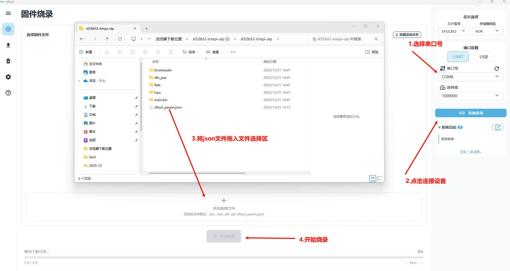

## 工具及固件下载

在开始之前，我们需要进行一些前置工具，请确保完成以下的步骤：

1. 下载sftool_gui工具：https://github.com/openSiFli/sftool-gui/releases/latest , 选择自己电脑系统的安装包进行下载，按照安装提示傻瓜式安装即可。

2. 下载固件：
开发板的固件位于 <https://github.com/78/xiaozhi-sf32/releases>，我们下载最新release版本的压缩包。

3. 开发板对应固件：
SF32LB52-DevKit-ULP（黄山派）: sf32lb52-lchspi-ulp.zip
SF32LB52-DevKit-LCD: sf32lb52-lcd_n16r8.zip
SF32LB52-DevKit-Nano: sf32lb52-nano_52j.zip
小汤圆直插版（立创训练营）: sf32lb52-xty-ai-tht.zip

## 烧录固件
双击运行gui工具，进入烧录界面。打开解压后的固件文件夹，按如下图步骤操作：
 

烧录成功后重新复位开发板即可。